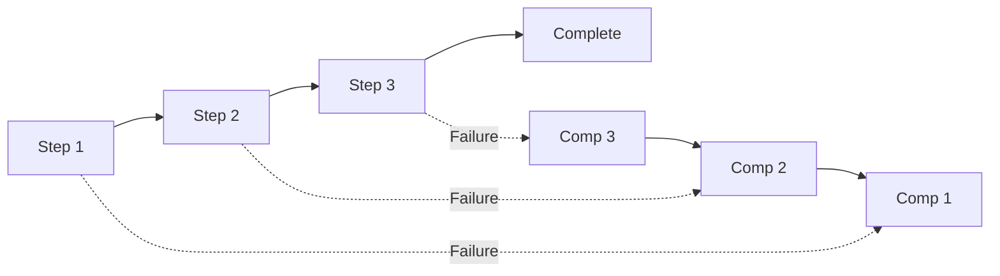
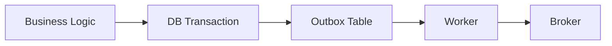

# Sagaz Documentation

> Production-ready Saga Pattern library with Transactional Outbox support

---

## 📖 Quick Navigation

### By Role

| I am a... | Start Here |
|-----------|-----------|
| **New User** | [Quickstart](quickstart.md) |
| **Developer** | [Architecture](architecture/overview.md) |
| **Operator** | [Kubernetes Guide](guides/kubernetes.md) |
| **Architect** | [ADR Index](architecture/adr/README.md) |

### By Topic

| Topic | Docs |
|-------|------|
| **Getting Started** | [Quickstart](quickstart.md), [Configuration](guides/configuration.md) |
| **Patterns** | [Consumer Inbox](patterns/consumer-inbox.md), [DLQ](patterns/dead-letter-queue.md) |
| **Operations** | [Kubernetes](guides/kubernetes.md), [Benchmarking](guides/benchmarking.md) |
| **Examples** | [Runnable Examples](../examples/) |
| **Contributing** | [Contributing Guide](development/contributing.md), [Testing Guide](development/testing.md) |
| **Strategy** | [Roadmap](ROADMAP.md) |

---

## Quick Links

| I want to... | Go to |
|-------------|-------|
| **Get started quickly** | [Quickstart Guide](quickstart.md) |
| **Configure storage/broker/observability** | [Configuration Guide](guides/configuration.md) |
| **See runnable examples** | [Examples](../examples/) |
| **Understand the architecture** | [Architecture Overview](architecture/overview.md) |
| **See how data flows** | [Dataflow & Events](architecture/dataflow.md) |
| **Deploy to Kubernetes** | [Kubernetes Guide](guides/kubernetes.md) |
| **Run benchmarks** | [Benchmarking Guide](guides/benchmarking.md) |
| **See what's planned** | [Roadmap & Strategy](ROADMAP.md) |
| **Contribute** | [Contributing Guide](development/contributing.md) |

---

## Documentation Structure

```
docs/
├── quickstart.md              # 5-minute setup
├── ROADMAP.md                 # Roadmap & Strategy 2026
├── architecture/              # System design
│   ├── overview.md
│   ├── components.md
│   ├── dataflow.md
│   ├── decisions.md
│   ├── adr/                   # Architecture Decision Records
│   └── diagrams/
├── guides/                    # How-to guides
├── patterns/                  # Implementation patterns
├── integrations/              # External integrations
├── monitoring/                # Observability reference
├── reference/                 # API reference
├── development/               # Contributing, testing, changelog
│   ├── contributing.md        # Branching, commits, TDD policy
│   ├── testing.md
│   ├── makefile.md
│   └── changelog.md
└── archive/                   # Historical documentation
```

For details on where to add new content, see [STRUCTURE.md](STRUCTURE.md).

---

## Key Concepts

### The Saga Pattern

A Saga is a sequence of local transactions where each step has a compensating action. If any step fails, the saga executes compensations in reverse order.


```mermaid
graph LR
    S1[Step 1] --> S2[Step 2]
    S2 --> S3[Step 3]
    S3 --> Complete[Complete]
    
    S1 -.->|Failure| C1[Comp 1]
    S2 -.->|Failure| C2[Comp 2]
    S3 -.->|Failure| C3[Comp 3]
    C3 --> C2
    C2 --> C1
```

### Transactional Outbox

Ensures exactly-once event delivery by storing events in the database within the same transaction as business data, then publishing asynchronously.


```mermaid
graph LR
    BL[Business Logic] --> DBT[DB Transaction]
    DBT --> OT[Outbox Table]
    OT --> W[Worker]
    W --> B[Broker]
```

---

## Performance

| Metric | Local (kind) | Production Target |
|--------|-------------|-------------------|
| Insert Rate | 1,800/sec | 10,000+/sec |
| Process Rate | 1,265/sec | 5,000+/sec |
| Latency (p99) | <100ms | <50ms |

See [Benchmarking Guide](guides/benchmarking.md) for details.

---

## Related

- [GitHub Repository](https://github.com/brunolnetto/sagaz)
- [PyPI Package](https://pypi.org/project/sagaz/)
- [Roadmap & Strategy](ROADMAP.md)
