# ADR Implementation Roadmap & Dependencies

**Last Updated**: 2026-01-12  
**Total ADRs**: 19 (011-029)  
**Remaining ADRs**: 5 (proposed, not yet implemented)  
**Implemented ADRs**: 14 (including ADR-019 Dry-Run Mode)

---

## 📊 Quick Summary

**Total Remaining Effort (AI-Supported):** 12-16.5 weeks (3-4 months)

| Priority | ADRs | Total Duration | Notes |
|----------|------|----------------|-------|
| 🔴 High | 2 | **8-11.5 weeks** | Core features: Multi-Tenancy, Choreography |
| 🟡 Medium | 2 | **3-4 weeks** | Operations: Chaos, Versioning |
| 🔵 Low | 3 | **7-9.5 weeks** | Optional: Schema, CDC, Analytics |

**Fastest Path (2 developers):** 5-8 weeks (High Priority only)  
**Complete Path (2 developers):** 11-16 weeks (All 7 ADRs)

📈 **See Critical Path Analysis below** for DAG-based timing, parallel execution scenarios, and detailed duration breakdowns.

---

## Legend

- 🟢 **Implemented** - Feature complete and production-ready
- 🟡 **In Progress** - Partially implemented, actively being worked on
- ⚪ **Proposed** - Design complete, awaiting implementation
- 🔵 **Accepted** - Design approved, not yet started

---

## Current Status Overview

| ADR | Title | Status | Priority | Complexity | Duration (AI)** |
|-----|-------|--------|----------|------------|----------------|
| [ADR-011](adr/adr-011-cdc-support.md) | CDC Support | ⚪ Proposed | 🔵 Low | High | 3.5-5 weeks |
| [ADR-012](adr/adr-012-synchronous-orchestration-model.md) | Synchronous Orchestration | 🟢 **Implemented** | - | - | - |
| [ADR-013](adr/adr-013-fluss-iceberg-analytics.md) | Fluss + Iceberg Analytics | ⚪ Proposed | 🔵 Low | High | 2.5-3 weeks |
| [ADR-014](adr/adr-014-schema-registry.md) | Schema Registry | ⚪ Proposed | 🔵 Low | Medium | 1-1.5 weeks |
| [ADR-015](adr/adr-015-unified-saga-api.md) | Unified Saga API | 🟢 **Implemented** | - | - | - |
| [ADR-016](adr/adr-016-unified-storage-layer.md) | Unified Storage Layer | 🟢 **Implemented** | - | - | - |
| [ADR-017](adr/adr-017-chaos-engineering.md) | Chaos Engineering | ⚪ Proposed | 🟡 Medium | Medium | 1-1.5 weeks |
| [ADR-018](adr/adr-018-saga-versioning.md) | Saga Versioning | ⚪ Proposed | 🟡 Medium | High | 2-2.5 weeks |
| [ADR-019](adr/adr-019-dry-run-mode.md) | Dry Run Mode | 🟢 **Implemented** | - | - | - |
| [ADR-020](adr/adr-020-multi-tenancy.md) | Multi-Tenancy | ⚪ Proposed | 🔴 High | High | 2-2.5 weeks |
| [ADR-021](adr/adr-021-lightweight-context-streaming.md) | Context Streaming | 🟢 **Implemented** | - | - | - |
| [ADR-022](adr/adr-022-compensation-result-passing.md) | Compensation Result Passing | 🟢 **Implemented** | - | - | - |
| [ADR-023](adr/adr-023-pivot-irreversible-steps.md) | Pivot/Irreversible Steps | 🟢 **Implemented** | - | - | - |
| [ADR-024](adr/adr-024-saga-replay.md) | Saga Replay & Time-Travel | 🟢 **Production-Ready** (All 6 Phases) | - | - | - |
| [ADR-025](adr/adr-025-event-driven-triggers.md) | Event-Driven Triggers | 🟢 **Implemented** | - | - | - |
| [ADR-026](adr/adr-026-industry-examples-expansion.md) | Industry Examples Expansion | 🟢 **Complete** (24 examples) | - | - | - |
| [ADR-027](adr/adr-027-project-cli.md) | Project CLI | 🟢 **Implemented** | - | - | - |
| [ADR-028](adr/adr-028-framework-integration.md) | Framework Integration | 🟢 **Implemented** | - | - | - |
| [ADR-029](adr/adr-029-saga-choreography.md) | Saga Choreography Pattern | ⚪ Proposed | 🔴 High | High | 6-9 weeks ⭐ |

**Duration (AI)**: AI-agent supported development time. See [ADR Effort Estimates](ADR_EFFORT_ESTIMATES.md) for detailed task breakdowns and Critical Path Analysis section below.

**Priority Legend:**
- 🔴 **High** - Critical features, implement first
- 🟡 **Medium** - Important operations features
- 🔵 **Low** - Optional/future features

---

## Dependency Matrix

### Core Infrastructure (Must Implement First)

```mermaid
graph TD
    ADR016[ADR-016: Unified Storage ✅] --> ADR021[ADR-021: Context Streaming ✅]
    ADR016 --> ADR024[ADR-024: Saga Replay ✅ All 6 Phases]
    ADR016 --> ADR020[ADR-020: Multi-Tenancy]
    ADR016 --> ADR011[ADR-011: CDC Support]
    
    ADR022[ADR-022: Compensation Passing ✅] --> ADR023[ADR-023: Pivot Steps ✅]
    ADR023 --> ADR026[ADR-026: Industry Examples ✅]
    
    style ADR016 fill:#51cf66
    style ADR022 fill:#51cf66
    style ADR023 fill:#51cf66
    style ADR026 fill:#51cf66
    style ADR021 fill:#51cf66
    style ADR024 fill:#51cf66
```



### Feature Dependencies (With Duration Estimates and Priorities)

```mermaid
graph TD
    %% Implemented ADRs (no duration needed)
    ADR016["ADR-016: Storage ✅<br/>DONE"]
    ADR021["ADR-021: Streaming ✅<br/>DONE"]
    ADR022["ADR-022: Compensation ✅<br/>DONE"]
    ADR023["ADR-023: Pivots ✅<br/>DONE"]
    ADR024["ADR-024: Replay ✅<br/>DONE"]
    ADR025["ADR-025: Event Triggers ✅<br/>DONE"]
    ADR026["ADR-026: Examples ✅<br/>DONE"]
    ADR027["ADR-027: CLI ✅<br/>DONE"]
    ADR028["ADR-028: Frameworks ✅<br/>DONE"]
    
    %% Proposed ADRs with durations and priority
    ADR011["ADR-011: CDC Support<br/>⏱️ 3.5-5 weeks<br/>🔵 Priority: LOW"]
    ADR013["ADR-013: Fluss Analytics<br/>⏱️ 2.5-3 weeks<br/>🔵 Priority: LOW"]
    ADR014["ADR-014: Schema Registry<br/>⏱️ 1-1.5 weeks<br/>🔵 Priority: LOW"]
    ADR017["ADR-017: Chaos Engineering<br/>⏱️ 1-1.5 weeks<br/>🟡 Priority: MEDIUM"]
    ADR018["ADR-018: Versioning<br/>⏱️ 2-2.5 weeks<br/>🟡 Priority: MEDIUM"]
    ADR019["ADR-019: Dry Run ✅<br/>✅ Implemented v1.3.0"]
    ADR020["ADR-020: Multi-Tenancy<br/>⏱️ 2-2.5 weeks<br/>🔴 Priority: HIGH"]
    ADR029["ADR-029: Choreography<br/>⏱️ 6-9 weeks<br/>🔴 Priority: HIGH"]
    
    %% Storage dependencies
    ADR016 --> ADR021
    ADR016 --> ADR024
    ADR016 --> ADR020
    ADR016 --> ADR011
    ADR016 --> ADR028
    ADR016 --> ADR029
    
    %% Event trigger dependencies
    ADR025 --> ADR011
    ADR025 --> ADR029
    
    %% Compensation chain
    ADR022 --> ADR023
    ADR023 --> ADR026
    
    %% Replay dependencies
    ADR024 --> ADR018
    ADR024 --> ADR019
    
    %% Optional synergies (dotted lines)
    ADR021 -.-> ADR013
    ADR029 -.-> ADR013
    ADR017 -.-> ADR029
    ADR024 -.-> ADR029
    
    %% Styling - Color by Status and Priority
    %% Green = Implemented
    style ADR016 fill:#51cf66,stroke:#2f9e44,stroke-width:2px
    style ADR021 fill:#51cf66,stroke:#2f9e44,stroke-width:2px
    style ADR022 fill:#51cf66,stroke:#2f9e44,stroke-width:2px
    style ADR023 fill:#51cf66,stroke:#2f9e44,stroke-width:2px
    style ADR024 fill:#51cf66,stroke:#2f9e44,stroke-width:2px
    style ADR025 fill:#51cf66,stroke:#2f9e44,stroke-width:2px
    style ADR026 fill:#51cf66,stroke:#2f9e44,stroke-width:2px
    style ADR027 fill:#51cf66,stroke:#2f9e44,stroke-width:2px
    style ADR028 fill:#51cf66,stroke:#2f9e44,stroke-width:2px
    style ADR019 fill:#51cf66
    
    %% Red = High Priority (CRITICAL)
    style ADR020 fill:#ff6b6b,stroke:#e03131,stroke-width:3px,color:#fff
    style ADR029 fill:#ff6b6b,stroke:#e03131,stroke-width:3px,color:#fff
    
    %% Yellow = Medium Priority
    style ADR017 fill:#ffd43b,stroke:#fab005,stroke-width:2px
    style ADR018 fill:#ffd43b,stroke:#fab005,stroke-width:2px
    
    %% Blue = Low Priority (OPTIONAL)
    style ADR011 fill:#74c0fc,stroke:#339af0,stroke-width:2px
    style ADR013 fill:#74c0fc,stroke:#339af0,stroke-width:2px
    style ADR014 fill:#74c0fc,stroke:#339af0,stroke-width:2px
```



**Color Legend:**
- 🟢 **Green** = Implemented (production-ready ✅)
- 🔴 **Red** = 🔴 Critical Priority (implement first)
- 🟡 **Yellow** = 🟡 Medium Priority (important operations)
- 🔵 **Blue** = 🔵 Low Priority (optional/future features)

### Independent Features

- **ADR-017: Chaos Engineering** (1-1.5 weeks) - No dependencies, can implement anytime
- **ADR-014: Schema Registry** (1-1.5 weeks) - Standalone, integrates with triggers
- **ADR-019: Dry Run Mode** ✅ **Implemented v1.3.0** - `sagaz validate` and `sagaz simulate` commands
- **ADR-027: Project CLI** ✅ - Improves DX, independent - **Implemented**

---

## Critical Path Analysis & Parallel Execution

### DAG-Based Critical Path Durations

Since all high-priority dependencies are **already satisfied** (ADR-016 ✅, ADR-024 ✅, ADR-025 ✅), the critical path duration equals the direct implementation time for remaining ADRs.

| ADR | Direct Duration | Critical Path Duration | Notes |
|-----|----------------|------------------------|-------|
| **ADR-019** | ✅ Implemented | **v1.3.0** | Dry-run validation and simulation |
| **ADR-020** | 2-2.5 weeks | **2-2.5 weeks** | Dependencies satisfied ✅ (ADR-016) |
| **ADR-029** | 6-9 weeks | **6-9 weeks** ⭐ | Dependencies satisfied ✅ (ADR-016, ADR-025) |
| **ADR-017** | 1-1.5 weeks | **1-1.5 weeks** | No dependencies |
| **ADR-018** | 2-2.5 weeks | **2-2.5 weeks** | Dependencies satisfied ✅ (ADR-024) |

### Parallel Execution Scenarios

#### Scenario A: Single Developer (Sequential)
```
Month 1-2:  ADR-019 (0.5-1w) + ADR-020 (2-2.5w) = 3-3.5 weeks
Month 3-4:  ADR-029 (Choreography) = 6-9 weeks
Month 5-6:  ADR-017 (1-1.5w) + ADR-018 (2-2.5w) = 3-4 weeks

Total: 12.5-16.5 weeks (3-4 months)
```

#### Scenario B: Two Developers (Parallel) ⭐ Recommended
```
Developer A: Quick wins + operations
  Week 1:     ADR-019 (Dry Run) [0.5-1w]
  Week 2-4:   ADR-020 (Multi-Tenancy) [2-2.5w]
  Week 5-6:   ADR-017 (Chaos) [1-1.5w]
  Week 7-9:   ADR-018 (Versioning) [2-2.5w]
  Total: 6-9 weeks

Developer B: Major feature
  Week 1-9:   ADR-029 (Choreography) [6-9 weeks]
  Total: 6-9 weeks

Grand Total: max(6-9, 6-9) = 6-9 weeks (1.5-2.25 months) ✨
```

**Speedup**: 2 developers reduce time by **50-60%** (from 12.5-16.5 weeks to 6-9 weeks)

### Cumulative Duration by Priority

#### High Priority Only (3 ADRs):
- Sequential: 9-12.5 weeks (2-3 months)
- Parallel (2 devs): **6-9 weeks** (1.5-2.25 months) ✨

#### High + Medium Priority (5 ADRs):
- Sequential: 12-16 weeks (3-4 months)
- Parallel (2 devs): **6-9 weeks** (same as high-priority due to parallelization!)

#### All ADRs (8 ADRs):
- Sequential: 19-26 weeks (4.75-6.5 months)
- Parallel (2 devs): **12-17 weeks** (3-4.25 months)

---

## Critical Dependency Chains

### Chain 1: Storage → Context → Advanced Features

```
ADR-016 (Storage) ✅ → ADR-021 (Streaming) ✅ → ADR-013 (Analytics - optional)
ADR-016 (Storage) ✅ → ADR-029 (Choreography)
ADR-025 (Triggers) ✅ → ADR-029 (Choreography)
ADR-025 (Triggers) ✅ → ADR-011 (CDC)
```

**Rationale**: Large context objects need external storage (ADR-016) before streaming (ADR-021) makes sense. Choreography requires storage for event state tracking and triggers for event infrastructure. Fluss Analytics (ADR-013) is an optional enhancement for real-time event analytics - independent from choreography.

### Chain 2: Storage → Replay → Testing

```
ADR-016 (Storage) ✅ → ADR-024 (Replay) ✅ All 6 Phases → ADR-019 (Dry Run)
                                                        → ADR-018 (Versioning)
```

**Rationale**: Replay needs complete state snapshots. Versioning helps replay across schema changes.

**Status**: ✅ COMPLETE - All 6 phases implemented (snapshot infrastructure, replay engine, time-travel, CLI, compliance, storage backends)

### Chain 3: Compensation → Pivots

```
ADR-022 (Compensation Passing) ✅ → ADR-023 (Pivot Steps) ✅
```

**Rationale**: Pivots need compensation result context to make forward recovery decisions.

### Chain 4: Choreography (Independent Pattern)

```
ADR-016 (Storage) ✅ → ADR-029 (Choreography)
ADR-025 (Triggers) ✅ → ADR-029 (Choreography)

Optional Synergies:
ADR-013 (Analytics) - Real-time event analytics (independent)
ADR-017 (Chaos) - Testing distributed failures  
ADR-024 (Replay) ✅ - Replay choreographed sagas
```

**Rationale**: Choreography is an alternative coordination pattern to orchestration. It requires storage for event state tracking and triggers for event infrastructure. Analytics is an optional enhancement for event streams, not a requirement.

---

## Implementation Phases

### Phase 1: Foundation (v1.2.0) - **6-8 weeks**

**Goal**: Core infrastructure for advanced features

| ADR | Priority | Effort | Notes |
|-----|----------|--------|-------|
| ✅ ADR-016 | **Implemented** | 5-6 weeks | [Complete](implementation-plans/unified-storage-implementation-plan.md) |
| ✅ ADR-022 | High | 2 weeks | Simpler, can parallel with ADR-016 |

**Deliverables**:
- Unified storage layer (PostgreSQL, Redis, SQLite)
- Data transfer utilities
- Compensation result passing in context

**Blockers Removed For**:
- ADR-021, ADR-024, ADR-020, ADR-011

---

### Phase 2: Advanced Orchestration (v1.3.0) - **8-10 weeks**

**Goal**: Production-critical features for complex sagas

| ADR | Priority | Effort | Dependencies |
|-----|----------|--------|--------------|
| ✅ ADR-023 | **Complete** | 5-6 weeks | ADR-022 |
| ✅ ADR-025 | **Complete** | 4-5 weeks | None (can parallel) |
| 🟡 ADR-019 | Medium | 1-2 weeks | None |
| ✅ ADR-027 | **Implemented** | 2 weeks | None |
| ✅ ADR-028 | **Examples Created** | 4-5 weeks | ADR-016 |

**Deliverables**:
- ✅ Pivot steps with forward recovery (`sagaz/pivot.py`)
- Event-driven triggers (Kafka, RabbitMQ, Redis, Cron, Webhook)
- Dry run mode for testing
- Project scaffolding (`sagaz project init`, `check`, `list`) - **Complete**
- ✅ FastAPI, Django, Flask integration examples

**User Impact**:
- **High**: Enables real-world production scenarios (payment capture, model deployment)
- **High**: Enables streaming MLOps and event-driven architectures
- **High**: Drastically reduces boilerplate for web apps

---

### Phase 3: Scalability & Operations (v1.4.0) - **6-8 weeks**

**Goal**: Enterprise-grade features

| ADR | Priority | Effort | Dependencies |
|-----|----------|--------|--------------|
| ✅ ADR-021 | **Implemented** | 4-5 weeks | ADR-016 |
| 🟡 ADR-020 | Medium | 3-4 weeks | ADR-016 |
| 🟢 ADR-017 | Low | 2 weeks | None |
| ✅ ADR-026 | **Complete** | 5-6 weeks | ADR-023 |

**Deliverables**:
- Lightweight context with external storage
- Streaming sagas (generator-based)
- Multi-tenancy support
- Chaos engineering toolkit
- ✅ 24 industry examples created (fintech, manufacturing, healthcare, etc.)

**User Impact**:
- **Medium**: Performance improvements for large payloads
- **Medium**: Enables SaaS deployments

---

### Phase 4: Advanced Features (v2.0.0) - **10-12 weeks**

**Goal**: Advanced debugging, analytics, versioning

| ADR | Priority | Effort | Dependencies |
|-----|----------|--------|--------------|
| 🟡 ADR-024 | Medium | 4-5 weeks | ADR-016 |
| 🟡 ADR-018 | Medium | 3-4 weeks | ADR-024 (optional) |
| 🟢 ADR-014 | Low | 2 weeks | None |

**Deliverables**:
- Saga replay & time-travel debugging
- Saga versioning with migrations
- Schema registry integration

**User Impact**:
- **Medium**: Better debugging and incident response
- **Low**: Schema evolution support

---

### Phase 5: Analytics & CDC (Future/Optional)

**Goal**: High-throughput and analytics

| ADR | Priority | Effort | Dependencies |
|-----|----------|--------|--------------|
| 🟢 ADR-011 | Low | 6-8 weeks | ADR-016 |
| 🟢 ADR-013 | Low | 4-5 weeks | ADR-021, ADR-025 |

**Deliverables**:
- CDC-based outbox publishing (Debezium)
- Fluss + Iceberg real-time analytics

**User Impact**:
- **Low**: Only for very high throughput (50K+ events/sec)
- **Low**: Only for real-time analytics use cases

**Recommendation**: Wait for real user demand before implementing

---

### Phase 6: Choreography Pattern (v2.2.0) - **10-15 weeks**

**Goal**: Distributed saga coordination

| ADR | Priority | Effort | Dependencies |
|-----|----------|--------|--------------|
| 🟡 ADR-029 | High | 10-15 weeks | ADR-016, ADR-025 |

**Deliverables**:
- Event-driven choreography engine
- Kafka/RabbitMQ/Redis adapters
- Distributed tracing integration
- Choreographed saga examples

**Optional Synergies** (not required):
- ADR-013: Fluss Analytics (real-time event analytics)
- ADR-017: Chaos Engineering (testing distributed failures)
- ADR-024: Saga Replay (replay choreographed sagas)

**User Impact**:
- **High**: Enables microservices architectures
- **High**: Better scalability for event-driven systems
- **Medium**: Natural fit for autonomous team workflows

**Note**: Choreography and orchestration are complementary patterns. Choreography uses event buses for coordination, while analytics is an optional enhancement layer.

---

## Effort Summary by Phase

| Phase | Version | Duration | ADRs | Cumulative |
|-------|---------|----------|------|------------|
| 1 | v1.2.0 | 6-8 weeks | 2 | 8 weeks |
| 2 | v1.3.0 | 14-16 weeks | 5 | 24 weeks |
| 3 | v1.4.0 | 6-8 weeks | 3 | 26 weeks |
| 4 | v2.0.0 | 10-12 weeks | 3 | 38 weeks |
| 5 | Future | 10-13 weeks | 2 | 51 weeks |
| 6 | v2.2.0 | 10-15 weeks | 1 | 61 weeks |

**Total**: ~15 months for full implementation

---

## Recommended Priority Order

### Immediate (Next 3 Months)

1. **ADR-016: Unified Storage Layer** ⭐ **START HERE**
   - Blocks: 6 other ADRs
   - High user value (Redis outbox, data migration)
   - Clear implementation plan exists

2. **ADR-022: Compensation Result Passing** (Parallel)
   - Foundational for ADR-023
   - Low risk, high value
   - Can implement while storage work progresses

### Next (Months 4-6)

3. **ADR-023: Pivot/Irreversible Steps** ⭐ **HIGH IMPACT**
   - Production-critical (payment capture, model deployment)
   - Technically complex, needs careful design
   - Huge documentation (60KB ADR already exists!)

4. **ADR-025: Event-Driven Triggers** ⭐ **HIGH IMPACT**
   - Enables streaming MLOps
   - No blockers, can start immediately
   - Moderate complexity

5. **ADR-019: Dry Run Mode**
   - Simple, high developer value
   - Helps test ADR-023 and ADR-025

6. **ADR-027: Project CLI**
   - Essential for organizing complex projects
   - "Batteries included" experience

7. **ADR-028: Framework Integration**
   - Critical for adoption in web apps
   - High ROI (low effort, high value)

### Later (Months 7-12)

6. **ADR-021: Context Streaming**
7. **ADR-020: Multi-Tenancy**
8. **ADR-024: Saga Replay**
9. **ADR-018: Saga Versioning**

### Choreography Pattern (Months 13-16)

10. **ADR-029: Saga Choreography** ⭐ **HIGH IMPACT**
   - Enables microservices architectures
   - Event-driven coordination
   - Kafka/RabbitMQ integration
   - Distributed tracing

### Optional/Low Priority

10. **ADR-017: Chaos Engineering**
11. **ADR-014: Schema Registry**
12. **ADR-011: CDC Support**
13. **ADR-013: Fluss Analytics**

---

## Risk Assessment

### High-Risk ADRs (Require Careful Design)

| ADR | Risk Factors |
|-----|--------------|
| ADR-023 | Complex DAG analysis, forward recovery errors, tainting semantics |
| ADR-021 | Memory management, backpressure, streaming errors |
| ADR-016 | Data migration, backward compatibility, multi-backend testing |
| ADR-024 | State snapshot consistency, time-travel edge cases |

**Mitigation**: Prototype key algorithms, extensive testing, phased rollout

### Low-Risk ADRs (Straightforward)

- ADR-019: Dry Run Mode
- ADR-017: Chaos Engineering
- ADR-014: Schema Registry

---

## Implementation Strategy

### Parallel Work Streams

#### Stream A: Storage & Infrastructure
- ADR-016 (Weeks 1-6)
- ADR-021 (Weeks 7-11)

#### Stream B: Orchestration Features
- ADR-022 (Weeks 1-2)
- ADR-023 (Weeks 3-8)
- ADR-025 (Weeks 3-7, parallel with ADR-023)

#### Stream C: Testing & Operations
- ADR-019 (Week 9-10)
- ADR-017 (Weeks 11-12)

#### Stream D: Choreography (v2.2.0)
- ADR-029 (Weeks 52-67, after Phase 5)
  - Event bus infrastructure
  - Choreography engine
  - Distributed coordination

This allows **3 developers** to work in parallel with minimal conflicts.

---

## Decision Framework

**When to implement an ADR:**

✅ **Implement if**:
- Blocks other high-value features
- Solves a real production pain point
- Clear user demand exists

❌ **Defer if**:
- No current user need
- High complexity, low payoff
- Better alternatives exist

**Re-evaluate quarterly** based on user feedback and production usage patterns.

---

## Conclusion

**Recommended Focus Areas (Next 6 Months)**:

1. ✅ **ADR-016** (Unified Storage) - Foundation for everything else
2. ✅ **ADR-022** (Compensation Passing) - Quick win, enables pivots  
3. ✅ **ADR-023** (Pivot Steps) - Production-critical feature
4. ✅ **ADR-025** (Event Triggers) - Enables streaming MLOps
5. ✅ **ADR-019** (Dry Run) - Developer experience
6. ✅ **ADR-026** (Industry Examples) - Demonstrates pivot feature across 10 industries

These 6 ADRs deliver **80% of the value** with **40% of the effort**. 

**Next Priority (Months 13-16)**: 
- **ADR-029** (Saga Choreography) - Event-driven microservices coordination

The rest can wait for real user demand.
