# ADR Implementation Roadmap & Dependencies

**Last Updated**: 2026-01-10  
**Total ADRs**: 18 (011-028)

---

## Legend

- 🟢 **Implemented** - Feature complete and production-ready
- 🟡 **In Progress** - Partially implemented, actively being worked on
- ⚪ **Proposed** - Design complete, awaiting implementation
- 🔵 **Accepted** - Design approved, not yet started

---

## Current Status Overview

| ADR | Title | Status | Priority | Complexity |
|-----|-------|--------|----------|------------|
| [ADR-011](adr/adr-011-cdc-support.md) | CDC Support | ⚪ Proposed | Low | High |
| [ADR-012](adr/adr-012-synchronous-orchestration-model.md) | Synchronous Orchestration | 🟢 **Implemented** | - | - |
| [ADR-013](adr/adr-013-fluss-iceberg-analytics.md) | Fluss + Iceberg Analytics | ⚪ Proposed | Low | High |
| [ADR-014](adr/adr-014-schema-registry.md) | Schema Registry | ⚪ Proposed | Low | Medium |
| [ADR-015](adr/adr-015-unified-saga-api.md) | Unified Saga API | 🟢 **Implemented** | - | - |
| [ADR-016](adr/adr-016-unified-storage-layer.md) | Unified Storage Layer | 🟢 **Implemented** | - | - |
| [ADR-017](adr/adr-017-chaos-engineering.md) | Chaos Engineering | ⚪ Proposed | Low | Medium |
| [ADR-018](adr/adr-018-saga-versioning.md) | Saga Versioning | ⚪ Proposed | Medium | High |
| [ADR-019](adr/adr-019-dry-run-mode.md) | Dry Run Mode | ⚪ Proposed | Medium | Low |
| [ADR-020](adr/adr-020-multi-tenancy.md) | Multi-Tenancy | ⚪ Proposed | Medium | High |
| [ADR-021](adr/adr-021-lightweight-context-streaming.md) | Context Streaming | 🟢 **Implemented** | - | - |
| [ADR-022](adr/adr-022-compensation-result-passing.md) | Compensation Result Passing | 🟢 **Implemented** | - | - |
| [ADR-023](adr/adr-023-pivot-irreversible-steps.md) | Pivot/Irreversible Steps | 🟢 **Implemented** | - | - |
| [ADR-024](adr/adr-024-saga-replay.md) | Saga Replay & Time-Travel | 🟢 **Implemented** (All 5 phases) | - | - |
| [ADR-025](adr/adr-025-event-driven-triggers.md) | Event-Driven Triggers | 🟢 **Implemented** | - | - |
| [ADR-026](adr/adr-026-industry-examples-expansion.md) | Industry Examples Expansion | 🟢 **Complete** (24 examples) | - | - |
| [ADR-027](adr/adr-027-project-cli.md) | Project CLI | 🟢 **Implemented** | - | - |
| [ADR-028](adr/adr-028-framework-integration.md) | Framework Integration | 🟢 **Implemented** | - | - |

---

## Dependency Matrix

### Core Infrastructure (Must Implement First)

```mermaid
graph TD
    ADR016[ADR-016: Unified Storage ✅] --> ADR021[ADR-021: Context Streaming ✅]
    ADR016 --> ADR024[ADR-024: Saga Replay ✅ All 5 Phases]
    ADR016 --> ADR020[ADR-020: Multi-Tenancy]
    ADR016 --> ADR011[ADR-011: CDC Support]
    
    ADR022[ADR-022: Compensation Passing ✅] --> ADR023[ADR-023: Pivot Steps ✅]
    ADR023 --> ADR026[ADR-026: Industry Examples ✅]
    
    style ADR016 fill:#51cf66
    style ADR022 fill:#51cf66
    style ADR023 fill:#51cf66
    style ADR026 fill:#51cf66
    style ADR021 fill:#51cf66
    style ADR024 fill:#ff922b
```



### Feature Dependencies

```mermaid
graph TD
    %% Streaming dependencies (ADR-021 requires ADR-016)
    ADR016[ADR-016: Storage ✅] --> ADR021[ADR-021: Context Streaming ✅]
    
    %% Event triggers (independent, but enhances CDC)
    ADR025[ADR-025: Event Triggers ✅] --> ADR011[ADR-011: CDC Support]
    
    %% Replay chain
    ADR024[ADR-024: Saga Replay ✅] --> ADR018[ADR-018: Versioning]
    ADR024 --> ADR019[ADR-019: Dry Run]
    
    %% Multi-tenancy requires storage
    ADR016 --> ADR020[ADR-020: Multi-Tenancy]
    
    %% Advanced analytics requires streaming + triggers
    ADR021 --> ADR013[ADR-013: Fluss Analytics]
    ADR025 --> ADR013
    
    %% Framework integration requires storage
    ADR016 --> ADR028[ADR-028: Frameworks ✅]
    
    %% Pivot chain (independent of streaming!)
    ADR022[ADR-022: Compensation ✅] --> ADR023[ADR-023: Pivot Steps ✅]
    ADR023 --> ADR026[ADR-026: Examples ✅]
    
    style ADR016 fill:#51cf66
    style ADR022 fill:#51cf66
    style ADR023 fill:#51cf66
    style ADR026 fill:#51cf66
    style ADR028 fill:#51cf66
    style ADR025 fill:#51cf66
    style ADR027 fill:#51cf66
    style ADR021 fill:#51cf66
    style ADR024 fill:#51cf66

    %% Independent
    ADR027[ADR-027: Project CLI ✅]
```



### Independent Features

- **ADR-017: Chaos Engineering** - No dependencies, can implement anytime
- **ADR-014: Schema Registry** - Standalone, integrates with triggers
- **ADR-019: Dry Run Mode** - Can implement before or after other features
- **ADR-027: Project CLI** ✅ - Improves DX, independent - **Implemented**

---

## Critical Dependency Chains

### Chain 1: Storage → Context → Advanced Features

```
ADR-016 (Storage) ✅ → ADR-021 (Streaming) ✅ → ADR-013 (Analytics)
ADR-025 (Triggers) ✅ → ADR-011 (CDC)
```

**Rationale**: Large context objects need external storage (ADR-016) before streaming (ADR-021) makes sense. Triggers are largely independent but enable CDC.

### Chain 2: Storage → Replay → Testing

```
ADR-016 (Storage) ✅ → ADR-024 (Replay) ✅ All 5 Phases → ADR-019 (Dry Run)
                                                        → ADR-018 (Versioning)
```

**Rationale**: Replay needs complete state snapshots. Versioning helps replay across schema changes.

**Status**: ✅ COMPLETE - All 5 phases implemented (snapshot infrastructure, replay engine, time-travel, CLI, compliance)

### Chain 3: Compensation → Pivots

```
ADR-022 (Compensation Passing) → ADR-023 (Pivot Steps)
```

**Rationale**: Pivots need compensation result context to make forward recovery decisions.

---

## Implementation Phases

### Phase 1: Foundation (v1.2.0) - **6-8 weeks**

**Goal**: Core infrastructure for advanced features

| ADR | Priority | Effort | Notes |
|-----|----------|--------|-------|
| ✅ ADR-016 | **Implemented** | 5-6 weeks | [Complete](implementation-plans/unified-storage-implementation-plan.md) |
| ✅ ADR-022 | High | 2 weeks | Simpler, can parallel with ADR-016 |

**Deliverables**:
- Unified storage layer (PostgreSQL, Redis, SQLite)
- Data transfer utilities
- Compensation result passing in context

**Blockers Removed For**:
- ADR-021, ADR-024, ADR-020, ADR-011

---

### Phase 2: Advanced Orchestration (v1.3.0) - **8-10 weeks**

**Goal**: Production-critical features for complex sagas

| ADR | Priority | Effort | Dependencies |
|-----|----------|--------|--------------|
| ✅ ADR-023 | **Complete** | 5-6 weeks | ADR-022 |
| ✅ ADR-025 | **Complete** | 4-5 weeks | None (can parallel) |
| 🟡 ADR-019 | Medium | 1-2 weeks | None |
| ✅ ADR-027 | **Implemented** | 2 weeks | None |
| ✅ ADR-028 | **Examples Created** | 4-5 weeks | ADR-016 |

**Deliverables**:
- ✅ Pivot steps with forward recovery (`sagaz/pivot.py`)
- Event-driven triggers (Kafka, RabbitMQ, Redis, Cron, Webhook)
- Dry run mode for testing
- Project scaffolding (`sagaz project init`, `check`, `list`) - **Complete**
- ✅ FastAPI, Django, Flask integration examples

**User Impact**:
- **High**: Enables real-world production scenarios (payment capture, model deployment)
- **High**: Enables streaming MLOps and event-driven architectures
- **High**: Drastically reduces boilerplate for web apps

---

### Phase 3: Scalability & Operations (v1.4.0) - **6-8 weeks**

**Goal**: Enterprise-grade features

| ADR | Priority | Effort | Dependencies |
|-----|----------|--------|--------------|
| ✅ ADR-021 | **Implemented** | 4-5 weeks | ADR-016 |
| 🟡 ADR-020 | Medium | 3-4 weeks | ADR-016 |
| 🟢 ADR-017 | Low | 2 weeks | None |
| ✅ ADR-026 | **Complete** | 5-6 weeks | ADR-023 |

**Deliverables**:
- Lightweight context with external storage
- Streaming sagas (generator-based)
- Multi-tenancy support
- Chaos engineering toolkit
- ✅ 24 industry examples created (fintech, manufacturing, healthcare, etc.)

**User Impact**:
- **Medium**: Performance improvements for large payloads
- **Medium**: Enables SaaS deployments

---

### Phase 4: Advanced Features (v2.0.0) - **10-12 weeks**

**Goal**: Advanced debugging, analytics, versioning

| ADR | Priority | Effort | Dependencies |
|-----|----------|--------|--------------|
| 🟡 ADR-024 | Medium | 4-5 weeks | ADR-016 |
| 🟡 ADR-018 | Medium | 3-4 weeks | ADR-024 (optional) |
| 🟢 ADR-014 | Low | 2 weeks | None |

**Deliverables**:
- Saga replay & time-travel debugging
- Saga versioning with migrations
- Schema registry integration

**User Impact**:
- **Medium**: Better debugging and incident response
- **Low**: Schema evolution support

---

### Phase 5: Analytics & CDC (Future/Optional)

**Goal**: High-throughput and analytics

| ADR | Priority | Effort | Dependencies |
|-----|----------|--------|--------------|
| 🟢 ADR-011 | Low | 6-8 weeks | ADR-016 |
| 🟢 ADR-013 | Low | 4-5 weeks | ADR-021, ADR-025 |

**Deliverables**:
- CDC-based outbox publishing (Debezium)
- Fluss + Iceberg real-time analytics

**User Impact**:
- **Low**: Only for very high throughput (50K+ events/sec)
- **Low**: Only for real-time analytics use cases

**Recommendation**: Wait for real user demand before implementing

---

## Effort Summary by Phase

| Phase | Version | Duration | ADRs | Cumulative |
|-------|---------|----------|------|------------|
| 1 | v1.2.0 | 6-8 weeks | 2 | 8 weeks |
| 2 | v1.3.0 | 14-16 weeks | 5 | 24 weeks |
| 3 | v1.4.0 | 6-8 weeks | 3 | 26 weeks |
| 4 | v2.0.0 | 10-12 weeks | 3 | 38 weeks |
| 5 | Future | 10-13 weeks | 2 | 51 weeks |

**Total**: ~1 year for full implementation

---

## Recommended Priority Order

### Immediate (Next 3 Months)

1. **ADR-016: Unified Storage Layer** ⭐ **START HERE**
   - Blocks: 6 other ADRs
   - High user value (Redis outbox, data migration)
   - Clear implementation plan exists

2. **ADR-022: Compensation Result Passing** (Parallel)
   - Foundational for ADR-023
   - Low risk, high value
   - Can implement while storage work progresses

### Next (Months 4-6)

3. **ADR-023: Pivot/Irreversible Steps** ⭐ **HIGH IMPACT**
   - Production-critical (payment capture, model deployment)
   - Technically complex, needs careful design
   - Huge documentation (60KB ADR already exists!)

4. **ADR-025: Event-Driven Triggers** ⭐ **HIGH IMPACT**
   - Enables streaming MLOps
   - No blockers, can start immediately
   - Moderate complexity

5. **ADR-019: Dry Run Mode**
   - Simple, high developer value
   - Helps test ADR-023 and ADR-025

6. **ADR-027: Project CLI**
   - Essential for organizing complex projects
   - "Batteries included" experience

7. **ADR-028: Framework Integration**
   - Critical for adoption in web apps
   - High ROI (low effort, high value)

### Later (Months 7-12)

6. **ADR-021: Context Streaming**
7. **ADR-020: Multi-Tenancy**
8. **ADR-024: Saga Replay**
9. **ADR-018: Saga Versioning**

### Optional/Low Priority

10. **ADR-017: Chaos Engineering**
11. **ADR-014: Schema Registry**
12. **ADR-011: CDC Support**
13. **ADR-013: Fluss Analytics**

---

## Risk Assessment

### High-Risk ADRs (Require Careful Design)

| ADR | Risk Factors |
|-----|--------------|
| ADR-023 | Complex DAG analysis, forward recovery errors, tainting semantics |
| ADR-021 | Memory management, backpressure, streaming errors |
| ADR-016 | Data migration, backward compatibility, multi-backend testing |
| ADR-024 | State snapshot consistency, time-travel edge cases |

**Mitigation**: Prototype key algorithms, extensive testing, phased rollout

### Low-Risk ADRs (Straightforward)

- ADR-019: Dry Run Mode
- ADR-017: Chaos Engineering
- ADR-014: Schema Registry

---

## Implementation Strategy

### Parallel Work Streams

#### Stream A: Storage & Infrastructure
- ADR-016 (Weeks 1-6)
- ADR-021 (Weeks 7-11)

#### Stream B: Orchestration Features
- ADR-022 (Weeks 1-2)
- ADR-023 (Weeks 3-8)
- ADR-025 (Weeks 3-7, parallel with ADR-023)

#### Stream C: Testing & Operations
- ADR-019 (Week 9-10)
- ADR-017 (Weeks 11-12)

This allows **3 developers** to work in parallel with minimal conflicts.

---

## Decision Framework

**When to implement an ADR:**

✅ **Implement if**:
- Blocks other high-value features
- Solves a real production pain point
- Clear user demand exists

❌ **Defer if**:
- No current user need
- High complexity, low payoff
- Better alternatives exist

**Re-evaluate quarterly** based on user feedback and production usage patterns.

---

## Conclusion

**Recommended Focus Areas (Next 6 Months)**:

1. ✅ **ADR-016** (Unified Storage) - Foundation for everything else
2. ✅ **ADR-022** (Compensation Passing) - Quick win, enables pivots  
3. ✅ **ADR-023** (Pivot Steps) - Production-critical feature
4. ✅ **ADR-025** (Event Triggers) - Enables streaming MLOps
5. ✅ **ADR-019** (Dry Run) - Developer experience
6. ✅ **ADR-026** (Industry Examples) - Demonstrates pivot feature across 10 industries

These 6 ADRs deliver **80% of the value** with **40% of the effort**. The rest can wait for real user demand.
