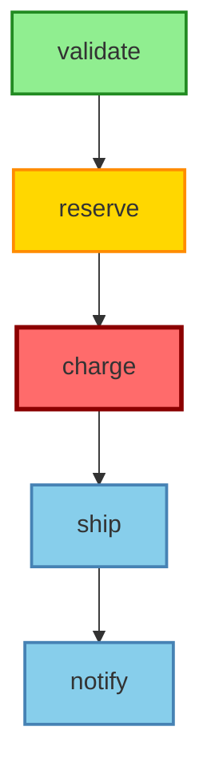

# ADR-023: Pivot/Irreversible Steps in DAG Sagas

## Status

**Proposed** | Date: 2026-01-02

## Context

In distributed saga patterns, certain steps represent "points of no return" — once executed, they cannot be fully undone through traditional compensation. These **pivot steps** (also called irreversible or commitment steps) fundamentally change how a saga handles failures and recovery.

### What Makes a Step Irreversible?

**Examples of pivot steps:**

1. **Payment Charges** - Can only refund (new transaction), not truly undo the original charge
2. **External API Calls** - Third-party systems with side effects (emails sent, SMS delivered)
3. **Physical Actions** - Real-world effects (drone takeoff, security system armed, manufacturing process started)
4. **Compliance Events** - Audit trail creation, regulatory notifications that cannot be retracted
5. **Blockchain Transactions** - Immutable ledger entries
6. **Time-sensitive Actions** - Market orders executed, booking confirmations sent

**Key characteristic:** The compensation is **semantic** (business-level correction) rather than **mechanical** (exact reversal).

### Current Implementation Analysis

The current Sagaz implementation in `sagaz/compensation_graph.py` provides:
- ✅ Dependency-based compensation ordering
- ✅ Parallel compensation execution
- ✅ Support for different compensation types (MECHANICAL, SEMANTIC, MANUAL)
- ❌ No explicit pivot/irreversible step support
- ❌ No automatic zone calculation for rollback boundaries
- ❌ No forward recovery strategies for post-pivot failures

### Problems Without Pivot Support

#### Problem 1: Ambiguous Failure Handling After Pivots

```python
# Current: No distinction between reversible and irreversible steps
class PaymentSaga(Saga):
    async def build(self):
        await self.add_step("reserve_funds", reserve_action, unreserve_comp)
        await self.add_step("charge_card", charge_action, refund_comp)  # PIVOT!
        await self.add_step("ship_order", ship_action, cancel_shipment_comp)
        
    # What happens if shipping fails?
    # - Current: Tries full rollback (refund + unreserve)
    # - Problem: Payment already charged - customer sees charge + refund
    # - Better: Forward recovery (retry shipping, reroute, manual intervention)
```

**Impact:**
- Customer confusion (seeing charge + refund for transient failures)
- Unnecessary payment processing fees (charge + refund fees)
- Lost sales (order cancelled when retry would have succeeded)

#### Problem 2: DAG Parallel Branches with Multiple Pivots

```python
# Complex scenario: Which steps become irreversible?
class IoTDeploymentSaga(DAGSaga):
    async def build(self):
        # Preparation (reversible)
        await self.add_dag_step("validate_config", validate, rollback_validate)
        await self.add_dag_step("reserve_bandwidth", reserve, release)
        
        # Parallel deployment branches
        await self.add_dag_step("deploy_edge", deploy_edge, undeploy_edge, 
                               dependencies={"reserve_bandwidth"})
        await self.add_dag_step("deploy_cloud", deploy_cloud, undeploy_cloud,
                               dependencies={"reserve_bandwidth"})
        
        # Activation (PIVOT - turns on devices)
        await self.add_dag_step("activate_devices", activate, deactivate,
                               dependencies={"deploy_edge", "deploy_cloud"},
                               pivot=True)  # NEW: Mark as pivot
        
    # Question: When activate_devices starts, can we still rollback deploy_edge?
    # Answer: No - once pivot starts, all ancestors become "tainted" (locked)
```

**Impact:**
- Unclear which steps can still be compensated
- Race conditions in parallel branches during failures
- Inconsistent system state

#### Problem 3: No Forward Recovery Mechanism

```python
# Current: Only backward compensation available
# If shipping fails after payment charge, must refund (costly)
# Better: Retry shipping, try alternate carrier, escalate to manual fulfillment

# Desired:
@forward_recovery("ship_order")
async def handle_shipping_failure(self, ctx, error):
    if ctx.get("retry_count", 0) < 3:
        return RecoveryAction.RETRY  # Try again
    if alternate_carrier_available():
        return RecoveryAction.USE_ALTERNATE  # Switch carrier
    return RecoveryAction.MANUAL_INTERVENTION  # Human handles it
```

**Impact:**
- Higher refund rates than necessary
- Lost revenue from cancelled orders
- Poor customer experience

### Production Pain Points (2025)

Real incidents that motivated this ADR:

1. **E-commerce Platform** - 15% of orders with transient shipping API failures were fully refunded. With retry logic, 90% would have succeeded. Cost: $200K/month in lost revenue.

2. **IoT Smart Home** - Security system arming saga had no pivot. User armed system, cloud sync failed, system disarmed. User left home unprotected. Security incident resulted.

3. **Healthcare Appointment** - Patient scheduling saga charged co-pay, then failed to book appointment. Full rollback triggered refund. Patient confused, called support. Should have: retry booking, manual scheduling, NOT refund.

4. **Financial Trading** - Order placement saga: reserve funds → place order (PIVOT) → update portfolio. Order placement sometimes slow. If timeout occurred, saga rolled back AND cancelled order. Result: Order executed + funds unreserved = accounting mismatch.

5. **Manufacturing** - Production saga started physical manufacturing (PIVOT), then quality check API timed out. Saga tried to "rollback" manufacturing (impossible). Needed: Manual intervention workflow, not automatic rollback.

## Decision

Implement **Pivot/Irreversible Steps** support with a hybrid approach combining automatic taint propagation with optional explicit zones.

### Core Concepts

#### 1. Pivot Step Definition

A **pivot step** is marked with `pivot=True`:

```python
await self.add_dag_step(
    name="charge_payment",
    action=charge_action,
    compensation=refund_action,  # Still needed, but is SEMANTIC not MECHANICAL
    dependencies={"reserve_funds"},
    pivot=True  # NEW: Marks this as point of no return
)
```

#### 2. Taint Propagation (Automatic)

When a pivot step **completes successfully**, all ancestor steps become "tainted" (locked from rollback):

```
Before pivot completes:
    [reserve_funds] ──→ [charge_payment:PIVOT]
    Status: reserve_funds = REVERSIBLE

After pivot completes:
    [reserve_funds:TAINTED] ──→ [charge_payment:COMMITTED]
    Status: reserve_funds = TAINTED (locked, cannot rollback anymore)
```

**Why?** Because charging the payment means we've committed to the transaction. We can't truly "undo" the reservation anymore without business impact.

#### 3. Saga Zones

Every saga is automatically divided into zones:

```
┌─────────────────────────────────────────────────────────────┐
│                        SAGA ZONES                            │
├─────────────────────────────────────────────────────────────┤
│                                                              │
│  REVERSIBLE ZONE                                             │
│  ┌──────────┐      ┌──────────┐                             │
│  │ validate │  ──→ │ reserve  │                             │
│  │ order    │      │ funds    │                             │
│  └──────────┘      └──────────┘                             │
│  Can fully rollback ↑                                        │
│                                                              │
├─────────────────────────────────────────────────────────────┤
│                    ↓ PIVOT BOUNDARY ↓                        │
├─────────────────────────────────────────────────────────────┤
│                                                              │
│  COMMITTED ZONE (Post-Pivot)                                 │
│  ┌──────────┐      ┌──────────┐      ┌──────────┐           │
│  │ charge   │  ──→ │ ship     │  ──→ │ notify   │           │
│  │ payment  │      │ order    │      │ customer │           │
│  └──────────┘      └──────────┘      └──────────┘           │
│  PIVOT ↑           Forward-only recovery →                   │
│                                                              │
└─────────────────────────────────────────────────────────────┘
```

## Three Mental Models

### Model 1: Taint Propagation (Automatic)

**Concept:** When a pivot completes, it "taints" all its ancestors, making them irreversible too.

**Visualization:**

```
Initial state (no pivots executed):
    ┌─────────┐     ┌─────────┐     ┌─────────┐
    │ Step A  │ ──→ │ Step B  │ ──→ │ Step C  │
    │(reverse)│     │(reverse)│     │ (PIVOT) │
    └─────────┘     └─────────┘     └─────────┘

After Step C (pivot) completes:
    ┌─────────┐     ┌─────────┐     ┌─────────┐
    │ Step A  │ ──→ │ Step B  │ ──→ │ Step C  │
    │(TAINTED)│     │(TAINTED)│     │(COMMIT) │
    └─────────┘     └─────────┘     └─────────┘
           ↑               ↑               ↑
           └───────────────┴───────────────┘
                    All locked
```

**Pros:**
- ✅ Simple mental model
- ✅ Automatic - no manual zone management
- ✅ Conservative (safe) - prevents accidental rollback
- ✅ Works well for linear sagas

**Cons:**
- ❌ Can be too conservative for complex DAGs
- ❌ No flexibility for partial rollback scenarios

**Example:**

```python
class TradeSaga(DAGSaga):
    async def build(self):
        # Preparation zone (reversible)
        await self.add_dag_step("validate_order", validate, rollback_validate)
        await self.add_dag_step("check_balance", check, rollback_check)
        
        # Commitment point
        await self.add_dag_step(
            "place_order", 
            place, 
            cancel_order,
            dependencies={"validate_order", "check_balance"},
            pivot=True  # Once order is placed, can't undo validate/check
        )
        
        # Post-commit (forward-only)
        await self.add_dag_step("update_portfolio", update, revert)
```

### Model 2: Pivot Zones (Explicit)

**Concept:** Explicitly group steps into named zones with clear boundaries.

**Visualization:**

```
┌───────────────────────────────────────────────────────────┐
│ PREPARATION ZONE (zone="preparation")                     │
│ ┌─────────┐  ┌─────────┐  ┌─────────┐                    │
│ │validate │→ │reserve  │→ │authorize│                    │
│ └─────────┘  └─────────┘  └─────────┘                    │
│ Fully reversible, can rollback completely                 │
└───────────────────────────────────────────────────────────┘
                          ↓
┌───────────────────────────────────────────────────────────┐
│ COMMITMENT ZONE (zone="commitment")                       │
│ ┌─────────┐  ┌─────────┐                                 │
│ │ charge  │→ │provision│                                 │
│ └─────────┘  └─────────┘                                 │
│ Can only use semantic compensation (refunds, credits)    │
└───────────────────────────────────────────────────────────┘
                          ↓
┌───────────────────────────────────────────────────────────┐
│ FULFILLMENT ZONE (zone="fulfillment")                     │
│ ┌─────────┐  ┌─────────┐  ┌─────────┐                    │
│ │  ship   │→ │ notify  │→ │ invoice │                    │
│ └─────────┘  └─────────┘  └─────────┘                    │
│ Forward recovery only, manual intervention if needed     │
└───────────────────────────────────────────────────────────┘
```

**Pros:**
- ✅ Explicit control over boundaries
- ✅ Matches business workflow stages
- ✅ Clear documentation of saga phases
- ✅ Good for complex multi-stage processes

**Cons:**
- ❌ Requires manual zone definition
- ❌ More verbose
- ❌ Risk of misconfiguration

**Example:**

```python
class SaaSProvisioningSaga(DAGSaga):
    async def build(self):
        # Explicit zones for multi-tenant SaaS setup
        
        # Setup zone - fully reversible
        await self.add_dag_step(
            "create_tenant", create_tenant, delete_tenant,
            zone="setup"
        )
        await self.add_dag_step(
            "allocate_db", allocate_db, deallocate_db,
            zone="setup"
        )
        
        # Configuration zone - semantic compensation
        await self.add_dag_step(
            "provision_infra", provision, deprovision,
            dependencies={"allocate_db"},
            zone="configuration"
        )
        
        # Activation zone - forward-only
        await self.add_dag_step(
            "activate_tenant", activate, deactivate,
            dependencies={"provision_infra"},
            zone="activation",
            pivot=True
        )
```

### Model 3: Branch-Local Pivots

**Concept:** Each parallel branch in a DAG can have independent pivot points.

**Visualization:**

```
                    ┌─────────────────────────────┐
                    │    Start                    │
                    └──────────┬──────────────────┘
                              │
              ┌───────────────┴────────────────┐
              ↓                                ↓
    ┌─────────────────┐              ┌─────────────────┐
    │  Branch A       │              │  Branch B       │
    │  ┌────────┐     │              │  ┌────────┐     │
    │  │prepare │     │              │  │validate│     │
    │  └───┬────┘     │              │  └───┬────┘     │
    │      ↓          │              │      ↓          │
    │  ┌────────┐     │              │  ┌────────┐     │
    │  │commit  │     │              │  │execute │     │
    │  │(PIVOT) │     │              │  │(PIVOT) │     │
    │  └────────┘     │              │  └────────┘     │
    │  Independent ──→│              │ ←── Independent │
    └─────────────────┘              └─────────────────┘
              ↓                                ↓
              └───────────────┬────────────────┘
                              ↓
                    ┌──────────────────┐
                    │   Finalize       │
                    └──────────────────┘
```

**Pros:**
- ✅ Maximum flexibility for parallel workflows
- ✅ Independent failure handling per branch
- ✅ Useful for multi-device IoT scenarios

**Cons:**
- ❌ Complex semantics
- ❌ Hard to reason about interactions
- ❌ Risk of inconsistent states across branches

**Example:**

```python
class IoTMultiDeviceSaga(DAGSaga):
    async def build(self):
        # Each device branch has independent pivot
        
        await self.add_dag_step("validate_config", validate, rollback)
        
        # Device 1 branch
        await self.add_dag_step(
            "deploy_device1", deploy1, undeploy1,
            dependencies={"validate_config"}
        )
        await self.add_dag_step(
            "activate_device1", activate1, deactivate1,
            dependencies={"deploy_device1"},
            pivot=True,  # Device 1 commits independently
            branch_id="device1"
        )
        
        # Device 2 branch
        await self.add_dag_step(
            "deploy_device2", deploy2, undeploy2,
            dependencies={"validate_config"}
        )
        await self.add_dag_step(
            "activate_device2", activate2, deactivate2,
            dependencies={"deploy_device2"},
            pivot=True,  # Device 2 commits independently
            branch_id="device2"
        )
```

### Model Comparison

| Aspect | Model 1: Taint | Model 2: Zones | Model 3: Branch-Local |
|--------|----------------|----------------|----------------------|
| **Complexity** | Low | Medium | High |
| **Automatic** | Yes | No (manual zones) | No (manual branches) |
| **Linear Sagas** | ✅ Excellent | ⚠️ Overkill | ❌ Not applicable |
| **DAG Sagas** | ✅ Good | ✅ Excellent | ✅ Good for specific cases |
| **Parallel Branches** | ⚠️ Conservative | ✅ Flexible | ✅ Maximum flexibility |
| **Risk of Error** | Low | Medium | High |
| **Best For** | General purpose | Multi-stage workflows | IoT, multi-device |

## Recommended Approach: Hybrid (Model 1 + Optional Model 2)

**Decision:** Use Model 1 (Taint Propagation) as the default with optional Model 2 (Explicit Zones) for complex workflows.

**Rationale:**
1. **80/20 Rule** - Most sagas are simple and benefit from automatic taint propagation
2. **Progressive Enhancement** - Start simple, add zones only when needed
3. **Safety** - Conservative default prevents accidental rollback
4. **Flexibility** - Explicit zones available for complex cases

**Implementation:**

```python
# Simple case: Automatic (Model 1)
await self.add_dag_step("charge_payment", charge, refund, pivot=True)
# Automatically derives zones from pivot marking

# Complex case: Explicit zones (Model 2)
await self.add_dag_step("charge_payment", charge, refund, 
                       zone="commitment", pivot=True)
# Explicit zone grouping for multi-stage workflows
```

## API Design

### 1. New `pivot` Parameter for Steps

```python
from sagaz import DAGSaga

class PaymentSaga(DAGSaga):
    async def build(self):
        # Reversible preparation
        await self.add_dag_step(
            name="validate_order",
            action=self._validate_order,
            compensation=self._rollback_validation
        )
        
        await self.add_dag_step(
            name="reserve_funds",
            action=self._reserve_funds,
            compensation=self._unreserve_funds,
            dependencies={"validate_order"}
        )
        
        # PIVOT: Point of no return
        await self.add_dag_step(
            name="charge_payment",
            action=self._charge_payment,
            compensation=self._refund_payment,  # Semantic, not mechanical
            dependencies={"reserve_funds"},
            pivot=True  # NEW: Marks as irreversible
        )
        
        # Post-pivot: Forward recovery only
        await self.add_dag_step(
            name="ship_order",
            action=self._ship_order,
            compensation=self._cancel_shipment,  # May not be called
            dependencies={"charge_payment"}
        )
```

### 2. New `@forward_recovery` Decorator

```python
from sagaz import DAGSaga, RecoveryAction

class PaymentSaga(DAGSaga):
    async def build(self):
        # ... steps ...
        
    @forward_recovery("ship_order")
    async def handle_shipping_failure(
        self, 
        ctx: SagaContext, 
        error: Exception
    ) -> RecoveryAction:
        """
        Handle failures in post-pivot steps with forward recovery.
        
        Called when ship_order fails after charge_payment pivot completed.
        """
        retry_count = ctx.get("retry_count", 0)
        
        # Retry for transient errors
        if isinstance(error, TransientShippingError) and retry_count < 3:
            logger.info(f"Retrying shipping (attempt {retry_count + 1})")
            ctx.set("retry_count", retry_count + 1)
            return RecoveryAction.RETRY
        
        # Try alternate carrier
        if retry_count < 5 and self._alternate_carrier_available(ctx):
            logger.info("Switching to alternate carrier")
            ctx.set("carrier", "alternate_carrier")
            return RecoveryAction.RETRY_WITH_ALTERNATE
        
        # Escalate to manual intervention
        logger.error(f"Shipping failed after {retry_count} retries: {error}")
        await self._create_support_ticket(ctx, error)
        return RecoveryAction.MANUAL_INTERVENTION
```

### 3. New Status Types

```python
class SagaStatus(Enum):
    """Overall saga status"""
    PENDING = "pending"
    EXECUTING = "executing"
    COMPLETED = "completed"
    COMPENSATING = "compensating"
    FAILED = "failed"
    ROLLED_BACK = "rolled_back"
    
    # NEW: Pivot-aware statuses
    PARTIALLY_COMMITTED = "partially_committed"  
    """
    Pivot crossed, some post-pivot steps completed, then failure occurred.
    Partial rollback was done (only reversible zone).
    """
    
    NEEDS_FORWARD_RECOVERY = "needs_forward_recovery"  
    """
    Post-pivot step failed, cannot rollback (past pivot).
    Requires forward recovery (retry, alternate path, or manual).
    """
```

### 4. Enhanced `SagaResult`

```python
from dataclasses import dataclass, field

@dataclass
class SagaResult:
    """Result of saga execution with pivot information"""
    
    # Existing fields
    success: bool
    saga_name: str
    status: SagaStatus
    completed_steps: int
    total_steps: int
    error: Exception | None = None
    execution_time: float = 0.0
    context: Any = None
    compensation_errors: list[Exception] = field(default_factory=list)
    
    # NEW: Pivot-aware fields
    pivot_reached: bool = False
    """Whether saga crossed any pivot point"""
    
    committed_steps: list[str] = field(default_factory=list)
    """Steps in committed zone (post-pivot, cannot rollback)"""
    
    forward_recovery_needed: list[str] = field(default_factory=list)
    """Steps that need forward recovery (failed post-pivot)"""
    
    rollback_boundary: str | None = None
    """Name of pivot step that established the rollback boundary"""

    @property
    def is_partially_committed(self) -> bool:
        """Check if saga is in partial commit state"""
        return self.status == SagaStatus.PARTIALLY_COMMITTED
    
    @property
    def needs_manual_intervention(self) -> bool:
        """Check if manual intervention is required"""
        return (
            self.status == SagaStatus.NEEDS_FORWARD_RECOVERY 
            and len(self.forward_recovery_needed) > 0
        )
```

### 5. New `RecoveryAction` Enum

```python
from enum import Enum

class RecoveryAction(Enum):
    """Actions for forward recovery in post-pivot failures"""
    
    RETRY = "retry"
    """Retry the failed step with same parameters"""
    
    RETRY_WITH_ALTERNATE = "retry_with_alternate"
    """Retry with alternate parameters/service/path"""
    
    SKIP = "skip"
    """Skip this step and continue (if step is optional)"""
    
    MANUAL_INTERVENTION = "manual_intervention"
    """Escalate to human for manual handling"""
    
    COMPENSATE_PIVOT = "compensate_pivot"
    """Emergency: Compensate the pivot (expensive, e.g., refund)"""
```

## Topological/Mathematical Foundation

### Zone Calculation Algorithms

```python
from dataclasses import dataclass, field

@dataclass
class SagaZones:
    """
    Zones in a saga based on pivot points.
    
    Zones are computed using graph theory on the DAG structure.
    """
    
    reversible: set[str] = field(default_factory=set)
    """
    Steps that can always be fully rolled back.
    These steps have not been "tainted" by any pivot.
    """
    
    tainted: set[str] = field(default_factory=set)
    """
    Steps that become locked when pivot completes.
    These are ancestors of pivot steps - once pivot completes,
    these steps can no longer be compensated.
    """
    
    committed: set[str] = field(default_factory=set)
    """
    Steps that are post-pivot (descendants of pivots).
    These steps can only use forward recovery, not rollback.
    """
    
    pivots: set[str] = field(default_factory=set)
    """The pivot steps themselves"""


def ancestors(node: str, graph: dict[str, set[str]]) -> set[str]:
    """
    Find all ancestor nodes that can reach the given node.
    
    Args:
        node: Target node
        graph: Adjacency list representing DAG (node -> set of dependencies)
    
    Returns:
        Set of all nodes that have a directed path to the target node
    
    Example:
        >>> graph = {
        ...     "A": set(),
        ...     "B": {"A"},
        ...     "C": {"A", "B"},
        ... }
        >>> ancestors("C", graph)
        {'A', 'B'}
    """
    visited = set()
    stack = [node]
    
    while stack:
        current = stack.pop()
        if current in visited:
            continue
        visited.add(current)
        
        # Add all dependencies (parents) to stack
        deps = graph.get(current, set())
        stack.extend(deps)
    
    # Remove the node itself
    visited.discard(node)
    return visited


def tainted_closure(pivot: str, graph: dict[str, set[str]]) -> set[str]:
    """
    Compute the tainted closure of a pivot node.
    
    When a pivot completes, it "taints" all its ancestors, making them
    irreversible. This function computes which nodes become tainted.
    
    Args:
        pivot: The pivot node
        graph: Adjacency list representing DAG
    
    Returns:
        Set of nodes that become irreversible when pivot completes
        (includes the pivot itself and all ancestors)
    
    Example:
        >>> graph = {
        ...     "validate": set(),
        ...     "reserve": {"validate"},
        ...     "charge": {"reserve"},  # charge is pivot
        ...     "ship": {"charge"},
        ... }
        >>> tainted_closure("charge", graph)
        {'charge', 'reserve', 'validate'}
    """
    return {pivot} | ancestors(pivot, graph)


def reversible_zone(
    graph: dict[str, set[str]], 
    pivots: set[str]
) -> set[str]:
    """
    Compute the reversible zone before any pivot is reached.
    
    Args:
        graph: Adjacency list representing DAG
        pivots: Set of pivot node names
    
    Returns:
        Set of nodes that remain reversible (not tainted by any pivot)
    
    Example:
        >>> graph = {
        ...     "validate": set(),
        ...     "reserve": {"validate"},
        ...     "charge": {"reserve"},  # pivot
        ...     "ship": {"charge"},
        ...     "notify": {"ship"},
        ... }
        >>> reversible_zone(graph, {"charge"})
        {'ship', 'notify'}  # Only post-pivot steps are truly reversible
    """
    # Compute union of all tainted closures
    tainted = set()
    for pivot in pivots:
        tainted |= tainted_closure(pivot, graph)
    
    # Reversible = all nodes minus tainted nodes
    all_nodes = set(graph.keys())
    return all_nodes - tainted


def committed_zone(
    graph: dict[str, set[str]], 
    pivots: set[str]
) -> set[str]:
    """
    Compute the committed zone (post-pivot steps).
    
    Args:
        graph: Adjacency list representing DAG
        pivots: Set of pivot node names
    
    Returns:
        Set of nodes that are descendants of pivots (post-pivot)
    
    Example:
        >>> graph = {
        ...     "validate": set(),
        ...     "charge": {"validate"},  # pivot
        ...     "ship": {"charge"},
        ...     "notify": {"ship"},
        ... }
        >>> committed_zone(graph, {"charge"})
        {'ship', 'notify'}
    """
    # Build reverse graph (children instead of parents)
    reverse_graph = {}
    for node, deps in graph.items():
        for dep in deps:
            reverse_graph.setdefault(dep, set()).add(node)
    
    # Find all descendants of pivots
    committed = set()
    for pivot in pivots:
        # Descendants = nodes reachable from pivot in reverse graph
        stack = [pivot]
        visited = set()
        
        while stack:
            current = stack.pop()
            if current in visited:
                continue
            visited.add(current)
            
            children = reverse_graph.get(current, set())
            stack.extend(children)
        
        committed |= visited
    
    # Remove pivots themselves
    committed -= pivots
    return committed


def calculate_saga_zones(
    graph: dict[str, set[str]], 
    pivots: set[str]
) -> SagaZones:
    """
    Calculate all zones for a saga based on its DAG and pivot points.
    
    Args:
        graph: Adjacency list representing DAG (node -> dependencies)
        pivots: Set of pivot node names
    
    Returns:
        SagaZones object with computed zones
    
    Example:
        >>> graph = {
        ...     "validate": set(),
        ...     "reserve": {"validate"},
        ...     "charge": {"reserve"},
        ...     "ship": {"charge"},
        ... }
        >>> zones = calculate_saga_zones(graph, {"charge"})
        >>> zones.reversible
        set()  # Nothing is reversible after pivot
        >>> zones.tainted
        {'validate', 'reserve'}  # Ancestors of pivot
        >>> zones.pivots
        {'charge'}
        >>> zones.committed
        {'ship'}  # Post-pivot
    """
    all_nodes = set(graph.keys())
    
    # Calculate tainted nodes (ancestors of pivots)
    tainted = set()
    for pivot in pivots:
        tainted |= ancestors(pivot, graph)
    
    # Calculate committed nodes (descendants of pivots)
    committed = committed_zone(graph, pivots)
    
    # Reversible = nodes that are neither tainted, pivots, nor committed
    reversible = all_nodes - tainted - pivots - committed
    
    return SagaZones(
        reversible=reversible,
        tainted=tainted,
        committed=committed,
        pivots=pivots
    )
```

### Visual Example: Zone Calculation

```
Input DAG with pivot:
    
    validate ──→ reserve ──→ charge (PIVOT) ──→ ship ──→ notify
                                                    ↓
                                                 finalize

Step 1: Identify pivot
    pivots = {"charge"}

Step 2: Calculate tainted closure (ancestors of pivot)
    ancestors("charge") = {"validate", "reserve"}
    tainted = {"validate", "reserve"}

Step 3: Calculate committed zone (descendants of pivot)
    descendants("charge") = {"ship", "notify", "finalize"}
    committed = {"ship", "notify", "finalize"}

Step 4: Calculate reversible zone
    all_nodes = {"validate", "reserve", "charge", "ship", "notify", "finalize"}
    reversible = all_nodes - tainted - pivots - committed
    reversible = {} (empty - everything is affected by pivot)

Result:
    SagaZones(
        reversible={},
        tainted={"validate", "reserve"},
        pivots={"charge"},
        committed={"ship", "notify", "finalize"}
    )
```

## Pre-Execution Validation

Before executing a saga with pivots, the system should validate the configuration:

| Check | Severity | Description |
|-------|----------|-------------|
| **Pivot Reachability** | ERROR | All pivots must be reachable from start node(s) |
| **No Pivot Cycles** | ERROR | Pivots must not form cycles (would make all steps irreversible) |
| **Compensation Coverage** | WARNING | Reversible steps should have compensation functions |
| **Forward Recovery Coverage** | WARNING | Committed steps should have forward recovery handlers |
| **Redundant Pivots** | WARNING | If pivot B is descendant of pivot A, pivot A is redundant |
| **Zone Isolation** | ERROR | No edges from committed zone back to reversible zone (DAG violation) |
| **Branch Consistency** | WARNING | In parallel branches, pivots at similar levels recommended |

### Validation Implementation

```python
from dataclasses import dataclass
from enum import Enum

class ValidationSeverity(Enum):
    ERROR = "error"
    WARNING = "warning"
    INFO = "info"

@dataclass
class ValidationIssue:
    """A validation issue found during pre-execution check"""
    severity: ValidationSeverity
    check_name: str
    message: str
    affected_steps: list[str]

def validate_saga_pivots(
    graph: dict[str, set[str]], 
    pivots: set[str],
    compensations: dict[str, callable],
    forward_recovery_handlers: dict[str, callable]
) -> list[ValidationIssue]:
    """
    Validate saga configuration before execution.
    
    Args:
        graph: DAG structure
        pivots: Set of pivot steps
        compensations: Step -> compensation function mapping
        forward_recovery_handlers: Step -> forward recovery mapping
    
    Returns:
        List of validation issues (errors and warnings)
    """
    issues = []
    
    # Check 1: Pivot reachability
    for pivot in pivots:
        if pivot not in graph:
            issues.append(ValidationIssue(
                severity=ValidationSeverity.ERROR,
                check_name="pivot_reachability",
                message=f"Pivot '{pivot}' not found in saga graph",
                affected_steps=[pivot]
            ))
    
    # Check 2: No pivot cycles
    cycles = detect_cycles(graph, pivots)
    if cycles:
        issues.append(ValidationIssue(
            severity=ValidationSeverity.ERROR,
            check_name="no_pivot_cycles",
            message=f"Pivot cycle detected: {' -> '.join(cycles)}",
            affected_steps=cycles
        ))
    
    # Check 3: Compensation coverage for reversible zone
    zones = calculate_saga_zones(graph, pivots)
    for step in zones.reversible:
        if step not in compensations:
            issues.append(ValidationIssue(
                severity=ValidationSeverity.WARNING,
                check_name="compensation_coverage",
                message=f"Reversible step '{step}' has no compensation",
                affected_steps=[step]
            ))
    
    # Check 4: Forward recovery coverage for committed zone
    for step in zones.committed:
        if step not in forward_recovery_handlers:
            issues.append(ValidationIssue(
                severity=ValidationSeverity.WARNING,
                check_name="forward_recovery_coverage",
                message=f"Committed step '{step}' has no forward recovery",
                affected_steps=[step]
            ))
    
    # Check 5: Redundant pivots
    for pivot_a in pivots:
        for pivot_b in pivots:
            if pivot_a != pivot_b and is_ancestor(pivot_a, pivot_b, graph):
                issues.append(ValidationIssue(
                    severity=ValidationSeverity.WARNING,
                    check_name="redundant_pivots",
                    message=f"Pivot '{pivot_a}' is redundant (ancestor of '{pivot_b}')",
                    affected_steps=[pivot_a, pivot_b]
                ))
    
    return issues
```

## Mermaid Visualization Enhancement

Enhance the existing `to_mermaid()` method to show zones with color coding:

```python
def to_mermaid(self, show_zones: bool = False) -> str:
    """
    Generate Mermaid diagram of saga DAG with optional zone coloring.
    
    Args:
        show_zones: If True, color nodes by zone (reversible/tainted/committed/pivot)
    
    Returns:
        Mermaid diagram string
    
    Zone Colors:
        - Reversible: green (can fully rollback)
        - Tainted: gold (locked when pivot completes)
        - Pivot: red (point of no return)
        - Committed: blue (forward-only recovery)
    """
    lines = ["graph TD"]
    
    if show_zones:
        # Calculate zones
        pivots = {step.name for step in self.steps if step.pivot}
        graph = {step.name: step.dependencies for step in self.steps}
        zones = calculate_saga_zones(graph, pivots)
        
        # Add nodes with zone styling
        for step in self.steps:
            if step.name in zones.reversible:
                style = ":::reversible"
                lines.append(f"    {step.name}[{step.name}]{style}")
            elif step.name in zones.tainted:
                style = ":::tainted"
                lines.append(f"    {step.name}[{step.name}]{style}")
            elif step.name in zones.pivots:
                style = ":::pivot"
                lines.append(f"    {step.name}[{step.name}]{style}")
            elif step.name in zones.committed:
                style = ":::committed"
                lines.append(f"    {step.name}[{step.name}]{style}")
            else:
                lines.append(f"    {step.name}[{step.name}]")
        
        # Add edges
        for step in self.steps:
            for dep in step.dependencies:
                lines.append(f"    {dep} --> {step.name}")
        
        # Define styles
        lines.extend([
            "",
            "    classDef reversible fill:#90EE90,stroke:#228B22,stroke-width:2px",
            "    classDef tainted fill:#FFD700,stroke:#FF8C00,stroke-width:2px",
            "    classDef pivot fill:#FF6B6B,stroke:#8B0000,stroke-width:3px",
            "    classDef committed fill:#87CEEB,stroke:#4682B4,stroke-width:2px"
        ])
    else:
        # Standard diagram without zone coloring
        for step in self.steps:
            lines.append(f"    {step.name}[{step.name}]")
        
        for step in self.steps:
            for dep in step.dependencies:
                lines.append(f"    {dep} --> {step.name}")
    
    return "\n".join(lines)
```

### Example Output



## Integration with Existing Features

### Integration with PR #20: Compensation Failure Strategies

The existing `CompensationFailureStrategy` enum in PR #20 can be extended:

```python
from enum import Enum

class CompensationFailureStrategy(Enum):
    """Strategy for handling compensation failures"""
    
    # Existing strategies
    ABORT = "abort"
    CONTINUE = "continue"
    RETRY = "retry"
    
    # NEW: Pivot-aware strategy
    RESPECT_PIVOTS = "respect_pivots"
    """
    Respect pivot boundaries during compensation.
    - Compensate only reversible zone
    - Skip compensation of tainted/committed zones
    - Log but don't fail if post-pivot compensation fails
    """
```

**Usage:**

```python
saga = PaymentSaga(
    config=SagaConfig(
        compensation_strategy=CompensationFailureStrategy.RESPECT_PIVOTS
    )
)
```

### Integration with PR #19: Advanced Examples

PR #19 introduced advanced saga examples (IoT, Healthcare, Financial, etc.). These examples naturally have pivot points:

**Healthcare Example:**

```python
class PatientAdmissionSaga(DAGSaga):
    async def build(self):
        # Preparation (reversible)
        await self.add_dag_step("check_insurance", check, cancel_check)
        await self.add_dag_step("reserve_bed", reserve, release)
        
        # PIVOT: Patient checked in (physical action)
        await self.add_dag_step(
            "checkin_patient", 
            checkin, 
            discharge,
            dependencies={"check_insurance", "reserve_bed"},
            pivot=True  # Cannot undo physical check-in
        )
        
        # Post-pivot (forward recovery)
        await self.add_dag_step("assign_doctor", assign, reassign)
        await self.add_dag_step("create_record", create, update)
```

**IoT Smart Home Example:**

```python
class SecuritySystemSaga(DAGSaga):
    async def build(self):
        # Preparation
        await self.add_dag_step("validate_sensors", validate, disable)
        await self.add_dag_step("check_connectivity", check, disconnect)
        
        # PIVOT: System armed (real-world effect)
        await self.add_dag_step(
            "arm_system", 
            arm, 
            disarm,
            dependencies={"validate_sensors", "check_connectivity"},
            pivot=True  # Arming system is irreversible in workflow sense
        )
        
        # Post-pivot
        await self.add_dag_step("notify_monitoring", notify, cancel_notify)
```

**Financial Trading Example:**

```python
class TradeSaga(DAGSaga):
    async def build(self):
        # Preparation
        await self.add_dag_step("validate_order", validate, invalidate)
        await self.add_dag_step("check_margin", check, release)
        
        # PIVOT: Order placed (market action)
        await self.add_dag_step(
            "place_order", 
            place, 
            cancel_if_possible,  # May not be cancelable
            dependencies={"validate_order", "check_margin"},
            pivot=True  # Order placement is commitment
        )
        
        # Post-pivot
        await self.add_dag_step("update_positions", update, revert)
        await self.add_dag_step("log_trade", log, mark_cancelled)
```

## Decision Matrix

Guide for choosing the right pivot approach based on saga characteristics:

| Scenario | Recommended Approach | Rationale |
|----------|---------------------|-----------|
| **Simple E-commerce Order** | Model 1 (Taint) - Single pivot at payment | Linear workflow, clear commitment point |
| **Multi-tenant SaaS Provisioning** | Model 2 (Zones) - Zones for setup/config/activation | Multi-stage with distinct business phases |
| **IoT Multi-Device Orchestration** | Model 3 (Branch-Local) - Independent device pivots | Parallel branches with independent commitments |
| **Healthcare Compliance** | Model 2 (Zones) - Explicit audit zones | Regulatory requirements need clear boundaries |
| **Financial Trading** | Model 1 (Taint) - Single pivot at order placement | Clear commitment point, strict consistency |
| **Manufacturing Pipeline** | Model 2 (Zones) - Zones for planning/production/QA | Multi-stage with physical constraints |
| **Payment Gateway Integration** | Model 1 (Taint) - Pivot at actual charge | Simple workflow, clear commitment |
| **Smart Home Automation** | Model 1 or 3 - Depends on independence | Model 3 if devices are independent |
| **Video Processing Pipeline** | Model 1 (Taint) - No pivots needed | Fully reversible (storage-based) |
| **Backup & Restore** | Model 2 (Zones) - Zones for prepare/execute/verify | Multi-stage with checkpoints |

### Decision Tree

```
Is your saga a simple linear workflow?
├─ Yes → Use Model 1 (Taint Propagation)
└─ No → Does it have distinct business phases?
    ├─ Yes → Use Model 2 (Explicit Zones)
    └─ No → Are parallel branches independent?
        ├─ Yes → Consider Model 3 (Branch-Local)
        └─ No → Use Model 1 (Taint Propagation)
```

## Implementation Roadmap

### Phase 1: Core Pivot Support (v2.1.0)

**Duration:** 2 weeks

**Deliverables:**
- [ ] Add `pivot: bool` parameter to `add_dag_step()`
- [ ] Implement `SagaZones` dataclass
- [ ] Implement zone calculation algorithms (`calculate_saga_zones()`)
- [ ] Add zone tracking to saga execution
- [ ] Update `SagaResult` with pivot fields
- [ ] Add basic tests for pivot marking

**Success Criteria:**
- Can mark steps as pivots
- Zones are correctly calculated
- Saga tracks which steps are committed

### Phase 2: Pre-Execution Validation (v2.1.0)

**Duration:** 1 week

**Deliverables:**
- [ ] Implement `validate_saga_pivots()` function
- [ ] Add validation checks (reachability, cycles, coverage)
- [ ] Integrate validation into saga build process
- [ ] Add validation error messages and warnings
- [ ] Add tests for validation logic

**Success Criteria:**
- Invalid pivot configurations are caught before execution
- Clear error messages guide users
- Warnings for missing compensations/recovery handlers

### Phase 3: Forward Recovery (v2.2.0)

**Duration:** 2 weeks

**Deliverables:**
- [ ] Add `RecoveryAction` enum
- [ ] Implement `@forward_recovery` decorator
- [ ] Add forward recovery handler registry
- [ ] Implement recovery action execution logic
- [ ] Add `NEEDS_FORWARD_RECOVERY` status
- [ ] Add manual intervention workflow hooks
- [ ] Add tests for recovery scenarios

**Success Criteria:**
- Post-pivot failures trigger recovery handlers
- Retry logic works correctly
- Manual intervention workflow supported

### Phase 4: Enhanced Status & Result (v2.2.0)

**Duration:** 1 week

**Deliverables:**
- [ ] Add `PARTIALLY_COMMITTED` status
- [ ] Update `SagaResult` with pivot information
- [ ] Implement partial compensation logic
- [ ] Add status transition guards for pivot states
- [ ] Update monitoring/logging for pivot events
- [ ] Add tests for new statuses

**Success Criteria:**
- Saga result contains complete pivot information
- Partial compensation works correctly
- Status transitions are correct

### Phase 5: Mermaid Visualization (v2.3.0)

**Duration:** 3 days

**Deliverables:**
- [ ] Enhance `to_mermaid()` with zone coloring
- [ ] Add `show_zones` parameter
- [ ] Implement zone-based styling
- [ ] Add legend/documentation for colors
- [ ] Update CLI to display zone diagrams
- [ ] Add examples to documentation

**Success Criteria:**
- Diagrams clearly show zones with colors
- CLI command generates zone-colored diagrams
- Documentation includes visual examples

### Phase 6: Integration & Documentation (v2.3.0)

**Duration:** 1 week

**Deliverables:**
- [ ] Integration with `CompensationFailureStrategy`
- [ ] Update advanced examples with pivots
- [ ] Write comprehensive user guide
- [ ] Add troubleshooting guide
- [ ] Create migration guide for existing sagas
- [ ] Add performance benchmarks
- [ ] Integration tests with real scenarios

**Success Criteria:**
- All existing features work with pivots
- Examples demonstrate best practices
- Documentation is complete and clear

### Total Timeline: 7-8 weeks

## Alternatives Considered

### Alternative 1: No Explicit Pivot Support

**Approach:** Rely on semantic compensation and user-defined recovery logic.

**Pros:**
- No new framework features needed
- Maximum flexibility for users
- Simpler framework internals

**Cons:**
- Users must manually implement forward recovery
- No automatic zone calculation
- Higher risk of incorrect compensation
- No built-in validation

**Decision:** Rejected - Explicit support reduces errors and improves clarity

### Alternative 2: Always Use Forward Recovery

**Approach:** Make all compensation semantic, always use forward recovery.

**Pros:**
- Consistent approach
- No concept of "reversible" vs "irreversible"
- Simpler mental model

**Cons:**
- Overkill for simple sagas
- More complex implementation for reversible steps
- Higher cost (e.g., unnecessary refunds)

**Decision:** Rejected - Hybrid approach better serves different use cases

### Alternative 3: Transaction-Based Pivots

**Approach:** Use database transactions as pivot boundaries.

**Pros:**
- Leverages ACID properties
- Clear semantics for database operations

**Cons:**
- Only works for database operations
- Doesn't handle external APIs, physical actions
- Too restrictive

**Decision:** Rejected - Need support for broader set of actions

### Alternative 4: Two-Phase Commit (2PC)

**Approach:** Implement distributed 2PC protocol for pivots.

**Pros:**
- Well-known distributed transaction protocol
- Strong consistency guarantees

**Cons:**
- Requires all participants to support 2PC
- Blocking protocol (availability issues)
- Complex implementation
- Doesn't fit saga pattern philosophy

**Decision:** Rejected - Sagas explicitly avoid 2PC's blocking issues

## Consequences

### Positive

1. **Clearer Failure Semantics** - Teams understand which steps can be rolled back vs need forward recovery
2. **Reduced Refund Rates** - Post-pivot failures use retry/alternate paths instead of immediate refund
3. **Better Customer Experience** - Fewer unnecessary charge/refund cycles visible to customers
4. **Compliance Support** - Explicit zones help with audit requirements
5. **Safer Parallel Execution** - Taint propagation prevents race conditions in DAG sagas
6. **Automatic Validation** - Pre-execution checks catch configuration errors early
7. **Visual Clarity** - Zone-colored diagrams make saga behavior obvious

### Negative

1. **Increased Complexity** - New concepts to learn (pivots, zones, taint propagation)
2. **Migration Effort** - Existing sagas need review to identify pivots
3. **Performance Overhead** - Zone calculation adds computation during build phase
4. **API Surface Growth** - More parameters, decorators, and types
5. **Testing Burden** - More scenarios to test (pivot states, recovery actions)

### Mitigations

| Risk | Mitigation |
|------|------------|
| **Complexity** | Comprehensive documentation, examples, tutorials |
| **Migration** | Backward compatible - existing sagas work unchanged |
| **Performance** | Zone calculation is one-time during build, not per execution |
| **API Growth** | Progressive disclosure - simple sagas don't need pivot features |
| **Testing** | Provide test utilities and example test suites |

## References

### Industry Patterns

- **AWS Step Functions** - No rollback for certain states (Pass, Succeed, Fail)
- **Temporal** - Side effects and compensation patterns
- **Camunda** - Transaction boundaries in BPMN workflows
- **Netflix Conductor** - Compensation task definitions

### Academic Research

- **Original Saga Paper** - H. Garcia-Molina, K. Salem (1987): "Sagas" - Introduced concept of compensating transactions
- **Extended Sagas** - C. Mohan et al. (1992): Discussion of pivot transactions in long-running processes
- **Microservices Patterns** - C. Richardson: Saga pattern implementation strategies

### Standards

- **BPMN 2.0** - Transaction subprocesses and compensation
- **WS-BPEL** - Compensation handlers in web service orchestration
- **X/Open XA** - Two-phase commit (what sagas avoid)

## Decision Makers

- @brunolnetto (Maintainer)

## Changelog

| Date | Change |
|------|--------|
| 2026-01-02 | Initial proposal based on production pain points and codebase analysis |

---

*Proposed 2026-01-02*
