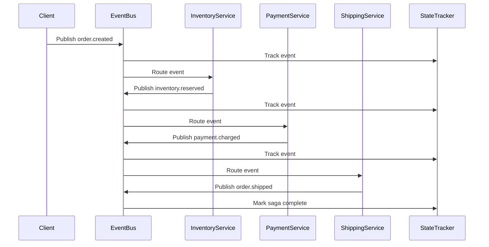

# ADR-029: Saga Choreography Pattern

## Status

**Proposed** | Date: 2026-01-10 | Priority: High | Target: v2.2.0

**Implementation Status:**
- ⚪ Phase 1: Event Bus Infrastructure (Not Started)
- ⚪ Phase 2: Choreography Engine (Not Started)
- ⚪ Phase 3: Event Sourcing Integration (Not Started)
- ⚪ Phase 4: Distributed Tracing (Not Started)
- ⚪ Phase 5: Testing & Observability (Not Started)

## Dependencies

**Prerequisites**:
- ADR-016: Unified Storage Layer (state management for event tracking)
- ADR-025: Event-Driven Triggers (event infrastructure foundation)

**Synergies** (Optional, not required):
- ADR-013: Fluss Analytics (real-time analytics on choreography events - independent feature)
- ADR-017: Chaos Engineering (testing distributed choreography failures)
- ADR-024: Saga Replay (replay choreographed sagas from snapshots)

**Note**: Choreography and Fluss Analytics are independent features that can be used together. Choreography uses event buses (Kafka/RabbitMQ) for coordination, while Fluss Analytics provides optional real-time analytics on those events. Neither requires the other.

**Roadmap**: **Phase 6 (v2.2.0)** - Advanced distributed patterns

## Context

Currently, Sagaz implements the **Orchestration** pattern where a central coordinator (Saga/DAGSaga) manages step execution. This is ideal for:
- Clear control flow
- Centralized error handling
- Simple debugging

However, many distributed systems benefit from **Choreography** pattern where:
- Services react to events independently
- No central coordinator (loose coupling)
- Better scalability and autonomy
- Natural fit for event-driven architectures

### Orchestration vs Choreography

| Aspect | Orchestration (Current) | Choreography (Proposed) |
|--------|-------------------------|-------------------------|
| **Coordination** | Central coordinator | Distributed, event-driven |
| **Coupling** | Tight (coordinator knows all steps) | Loose (services only know events) |
| **Control Flow** | Explicit (DAG) | Implicit (event reactions) |
| **Debugging** | Easy (single point) | Complex (distributed traces) |
| **Scalability** | Moderate (coordinator bottleneck) | High (parallel event processing) |
| **Autonomy** | Low (coordinator controls all) | High (services self-manage) |

### When to Use Choreography

✅ **Use Choreography for**:
- Microservices architectures with autonomous teams
- High-throughput event processing
- Services that evolve independently
- Natural event-driven workflows

❌ **Use Orchestration for**:
- Complex business logic with many branches
- Need for centralized monitoring
- Tight consistency requirements
- Single-team ownership

### Production Use Cases

1. **E-commerce Order Processing**
   ```
   OrderCreated → [InventoryService, PaymentService, ShippingService] → OrderCompleted
   ```
   Each service listens to events and publishes new events.

2. **Microservices Integration**
   ```
   UserRegistered → [EmailService, AnalyticsService, CRMService, WelcomeGiftService]
   ```
   Services independently react without coordinator.

3. **Event-Driven MLOps**
   ```
   ModelTrained → DeploymentService → ModelDeployed → MonitoringService
   ```
   Services coordinate through events.

## Decision

Implement **Saga Choreography** as an alternative execution pattern alongside existing orchestration:

### 1. Choreographed Saga Definition

```python
from sagaz import ChoreographedSaga, on_event, publish_event

class OrderSaga(ChoreographedSaga):
    """Choreographed order processing across microservices"""
    
    def __init__(self, order_id: str):
        super().__init__(saga_id=f"order-{order_id}")
        self.order_id = order_id
    
    @on_event("order.created")
    async def reserve_inventory(self, event: Event):
        """Inventory service reacts to order creation"""
        inventory_reserved = await inventory_api.reserve(
            order_id=event.data["order_id"],
            items=event.data["items"]
        )
        
        if inventory_reserved:
            await publish_event("inventory.reserved", {
                "order_id": self.order_id,
                "items": event.data["items"]
            })
        else:
            await publish_event("inventory.failed", {
                "order_id": self.order_id,
                "reason": "insufficient_stock"
            })
    
    @on_event("inventory.reserved")
    async def charge_payment(self, event: Event):
        """Payment service reacts to inventory reservation"""
        charged = await payment_api.charge(
            order_id=event.data["order_id"],
            amount=event.data["total"]
        )
        
        if charged:
            await publish_event("payment.charged", {
                "order_id": self.order_id,
                "transaction_id": charged.transaction_id
            })
        else:
            await publish_event("payment.failed", {
                "order_id": self.order_id
            })
    
    @on_event("payment.charged")
    async def ship_order(self, event: Event):
        """Shipping service reacts to payment"""
        shipped = await shipping_api.create_shipment(
            order_id=event.data["order_id"]
        )
        
        await publish_event("order.shipped", {
            "order_id": self.order_id,
            "tracking_number": shipped.tracking
        })
    
    # Compensation events
    @on_event("payment.failed")
    async def release_inventory(self, event: Event):
        """Compensate inventory on payment failure"""
        await inventory_api.release(event.data["order_id"])
        await publish_event("inventory.released", {
            "order_id": self.order_id
        })
    
    @on_event("inventory.failed")
    async def cancel_order(self, event: Event):
        """Cancel order on inventory failure"""
        await order_api.cancel(event.data["order_id"])
        await publish_event("order.cancelled", {
            "order_id": self.order_id,
            "reason": event.data["reason"]
        })
```

### 2. Event Bus Integration

```python
from sagaz.choreography import EventBus, KafkaAdapter, RabbitMQAdapter

# Kafka-based event bus
event_bus = EventBus(
    adapter=KafkaAdapter(
        bootstrap_servers=["localhost:9092"],
        topic_prefix="saga"
    )
)

# Register choreographed saga
await event_bus.register(OrderSaga)

# Trigger saga by publishing initial event
await event_bus.publish("order.created", {
    "order_id": "ORD-123",
    "items": [{"sku": "ABC", "qty": 2}],
    "total": 49.99
})
```

### 3. Choreography Engine

The engine manages:
- Event subscription and routing
- Saga state tracking (which events have been processed)
- Compensation triggering on failures
- Distributed tracing correlation

```python
from sagaz.choreography import ChoreographyEngine

engine = ChoreographyEngine(
    event_bus=event_bus,
    storage=redis_storage,  # Track saga state
    tracer=opentelemetry_tracer  # Distributed tracing
)

# Start engine (listens to all events)
await engine.start()
```

### 4. Failure Handling

Choreography uses **negative events** for compensation:

```
Happy Path:
  order.created → inventory.reserved → payment.charged → order.shipped

Failure Path:
  order.created → inventory.reserved → payment.failed → inventory.released → order.cancelled
```

Services automatically react to negative events without central coordinator.

## Architecture

### Component Structure

```
sagaz/choreography/
├── __init__.py
├── saga.py              # ChoreographedSaga base class
├── engine.py            # ChoreographyEngine (event routing)
├── event_bus.py         # EventBus abstraction
├── adapters/
│   ├── kafka.py         # Kafka adapter
│   ├── rabbitmq.py      # RabbitMQ adapter
│   ├── redis.py         # Redis pub/sub adapter
│   └── memory.py        # In-memory (testing)
├── tracing.py           # Distributed tracing integration
└── state.py             # Saga state tracking
```

### Event Flow



### State Tracking

Unlike orchestration, choreography needs state tracking to:
- Know which events have been processed
- Detect duplicate events (idempotency)
- Trigger compensation on failures
- Support saga replay

```python
# State stored in Redis/PostgreSQL
{
    "saga_id": "order-123",
    "saga_type": "OrderSaga",
    "status": "executing",
    "events_processed": [
        {"type": "order.created", "timestamp": "2024-12-15T10:00:00Z"},
        {"type": "inventory.reserved", "timestamp": "2024-12-15T10:00:01Z"},
        {"type": "payment.charged", "timestamp": "2024-12-15T10:00:02Z"}
    ],
    "correlation_id": "trace-xyz-789"
}
```

## Implementation Phases

### Phase 1: Event Bus Infrastructure (2-3 weeks)

**Deliverables**:
- `EventBus` abstraction
- Kafka, RabbitMQ, Redis adapters
- Event serialization/deserialization
- At-least-once delivery guarantees

**Tests**:
- Event publishing/subscription
- Adapter compatibility
- Error handling

### Phase 2: Choreography Engine (3-4 weeks)

**Deliverables**:
- `ChoreographedSaga` base class
- `@on_event` decorator
- Event routing logic
- State tracking integration

**Tests**:
- Simple saga execution
- Event correlation
- State persistence

### Phase 3: Failure Handling (2-3 weeks)

**Deliverables**:
- Compensation event triggering
- Saga timeout detection
- Dead letter queue handling
- Idempotency guarantees

**Tests**:
- Compensation scenarios
- Duplicate event handling
- Timeout behavior

### Phase 4: Distributed Tracing (1-2 weeks)

**Deliverables**:
- OpenTelemetry integration
- Trace context propagation
- Span creation per event
- Correlation ID tracking

**Tests**:
- Trace visualization
- Context propagation

### Phase 5: Observability & Testing (2-3 weeks)

**Deliverables**:
- Choreography metrics (events/sec, latency)
- Saga visualization (event graph)
- Testing utilities (mock event bus)
- Example implementations

**Tests**:
- Full integration tests
- Performance benchmarks
- Example validation

**Total**: ~10-15 weeks

## API Design

### Choreographed Saga

```python
from sagaz import ChoreographedSaga, on_event, publish_event

class MySaga(ChoreographedSaga):
    @on_event("event.name")
    async def handler(self, event: Event):
        # Business logic
        result = await some_api_call()
        
        # Publish next event
        await publish_event("next.event", {"data": result})
```

### Event Bus Configuration

```python
from sagaz.choreography import EventBus, KafkaAdapter

# Production: Kafka
event_bus = EventBus(
    adapter=KafkaAdapter(
        bootstrap_servers=["kafka-1:9092", "kafka-2:9092"],
        topic_prefix="saga",
        consumer_group="saga-engine"
    )
)

# Testing: In-memory
event_bus = EventBus(adapter=InMemoryAdapter())
```

### Engine Configuration

```python
from sagaz.choreography import ChoreographyEngine

engine = ChoreographyEngine(
    event_bus=event_bus,
    storage=redis_storage,
    tracer=opentelemetry_tracer,
    options={
        "timeout": 300,  # Saga timeout (5 min)
        "max_events": 100,  # Max events per saga
        "idempotency_window": 3600  # 1 hour dedup
    }
)
```

## Migration Strategy

### Coexistence with Orchestration

Both patterns coexist:

```python
# Orchestration (existing)
from sagaz import Saga

class OrderSaga(Saga):
    async def build(self):
        await self.add_step("reserve", reserve_inventory, release_inventory)
        await self.add_step("charge", charge_payment, refund_payment)

# Choreography (new)
from sagaz import ChoreographedSaga

class OrderSagaChoreographed(ChoreographedSaga):
    @on_event("order.created")
    async def reserve_inventory(self, event: Event):
        ...
```

Teams choose based on use case.

### Gradual Adoption

1. **Start with new features** - Use choreography for new microservices
2. **Keep existing sagas** - No need to migrate orchestrated sagas
3. **Hybrid approach** - Use both patterns in same system

## Examples

### Example 1: E-commerce Order (Choreography)

See: `sagaz/examples/ecommerce/order_choreography/main.py`

```python
class OrderChoreography(ChoreographedSaga):
    @on_event("order.created")
    async def reserve_inventory(self, event):
        # Inventory service logic
        
    @on_event("inventory.reserved")
    async def charge_payment(self, event):
        # Payment service logic
        
    @on_event("payment.charged")
    async def ship_order(self, event):
        # Shipping service logic
```

### Example 2: Microservices Registration (Choreography)

See: `sagaz/examples/integrations/user_registration_choreography/main.py`

```python
class UserRegistrationChoreography(ChoreographedSaga):
    @on_event("user.registered")
    async def send_welcome_email(self, event):
        # Email service
        
    @on_event("user.registered")
    async def create_analytics_profile(self, event):
        # Analytics service (parallel)
        
    @on_event("user.registered")
    async def sync_to_crm(self, event):
        # CRM service (parallel)
```

### Example 3: MLOps Deployment (Choreography)

See: `sagaz/examples/ml/model_deployment_choreography/main.py`

```python
class ModelDeploymentChoreography(ChoreographedSaga):
    @on_event("model.trained")
    async def deploy_to_staging(self, event):
        # Deployment service
        
    @on_event("staging.deployed")
    async def run_validation_tests(self, event):
        # Testing service
        
    @on_event("tests.passed")
    async def deploy_to_production(self, event):
        # Production deployment
        
    @on_event("tests.failed")
    async def rollback_deployment(self, event):
        # Compensation
```

## Testing Strategy

### Unit Tests

```python
@pytest.mark.asyncio
async def test_choreographed_saga():
    event_bus = EventBus(adapter=InMemoryAdapter())
    engine = ChoreographyEngine(event_bus, storage=InMemoryStorage())
    
    await engine.register(OrderSaga)
    await event_bus.publish("order.created", {"order_id": "123"})
    
    await asyncio.sleep(0.1)  # Let events process
    
    state = await engine.get_saga_state("order-123")
    assert state.status == "completed"
    assert len(state.events_processed) == 4
```

### Integration Tests

Test with real Kafka/RabbitMQ:

```python
@pytest.mark.integration
async def test_kafka_choreography():
    event_bus = EventBus(adapter=KafkaAdapter(...))
    engine = ChoreographyEngine(event_bus, redis_storage)
    
    await engine.start()
    # Test real event flow
```

## Observability

### Metrics

```python
# Choreography-specific metrics
choreography_events_published = Counter("choreography_events_published_total")
choreography_events_consumed = Counter("choreography_events_consumed_total")
choreography_saga_duration = Histogram("choreography_saga_duration_seconds")
choreography_event_latency = Histogram("choreography_event_latency_seconds")
```

### Distributed Tracing

```python
# Automatic trace context propagation
with tracer.start_as_current_span("saga.order.created"):
    await event_bus.publish("order.created", {...})

# Each event handler creates child span
@on_event("order.created")
async def handler(self, event):
    # Span automatically created: saga.order.created -> handler
    ...
```

### Visualization

Dashboard showing:
- Event flow graph (Graphviz/Mermaid)
- Saga execution timeline
- Compensation paths taken
- Error rates per event type

## Trade-offs

### Advantages

✅ **Loose Coupling**: Services don't know about each other  
✅ **Scalability**: Parallel event processing  
✅ **Autonomy**: Teams own their services  
✅ **Flexibility**: Easy to add new event handlers  

### Disadvantages

❌ **Complexity**: Harder to understand flow  
❌ **Debugging**: Distributed traces required  
❌ **Testing**: Need integration tests  
❌ **Consistency**: Eventually consistent by nature  

## Security Considerations

### Event Authorization

```python
@on_event("order.created", required_permissions=["orders:write"])
async def handler(self, event):
    # Only authorized services can handle
    ...
```

### Event Encryption

```python
event_bus = EventBus(
    adapter=KafkaAdapter(...),
    encryption=AES256Encryption(key=os.getenv("EVENT_KEY"))
)
```

## Performance

### Throughput

Expected performance:
- **10,000+ events/sec** (Kafka)
- **5,000+ events/sec** (RabbitMQ)
- **1,000+ events/sec** (Redis pub/sub)

### Latency

- Event publish: <5ms
- Event routing: <10ms
- End-to-end saga: depends on services

## Documentation

### User Guide

- `docs/user-guide/choreography/getting-started.md`
- `docs/user-guide/choreography/event-handlers.md`
- `docs/user-guide/choreography/failure-handling.md`
- `docs/user-guide/choreography/vs-orchestration.md`

### API Reference

- `docs/api/choreography/saga.md`
- `docs/api/choreography/event-bus.md`
- `docs/api/choreography/engine.md`

## Alternatives Considered

### 1. Only Use Orchestration

**Pros**: Simpler, one pattern  
**Cons**: Not suitable for microservices architectures

### 2. External Choreography Frameworks

Use existing tools (Temporal, Cadence, Apache Camel)

**Pros**: Battle-tested  
**Cons**: Doesn't integrate with Sagaz, learning curve

### 3. Hybrid Approach (Chosen)

Support both orchestration and choreography.

**Pros**: Flexibility, right tool for each job  
**Cons**: More code to maintain

## Success Metrics

1. **Adoption**: 20% of new sagas use choreography by v2.3.0
2. **Performance**: Handle 10K+ events/sec with <10ms routing latency
3. **Reliability**: 99.9% event delivery success rate
4. **Developer Feedback**: "Easy to build microservices sagas"

## References

- [Microservices Patterns (Chris Richardson)](https://microservices.io/patterns/data/saga.html)
- [Event-Driven Microservices (Kafka Summit)](https://www.confluent.io/blog/event-driven-microservices/)
- [Saga Pattern (Microsoft)](https://learn.microsoft.com/en-us/azure/architecture/reference-architectures/saga/saga)

## Future Enhancements (v2.3.0+)

1. **Saga Graphs**: Visualize event flow in real-time
2. **Event Replay**: Replay events for debugging (integration with ADR-024)
3. **CQRS Integration**: Separate read/write models
4. **Event Sourcing**: Store all events as source of truth (ADR-030)
5. **Multi-Region**: Event replication across regions
6. **Schema Evolution**: Handle event schema changes

---

**Decision**: Approved for implementation in **v2.2.0**  
**Owner**: Core Team  
**Reviewers**: Architecture Team, DevOps  
**Next Steps**: Create implementation plan in `docs/architecture/implementation-plans/`
