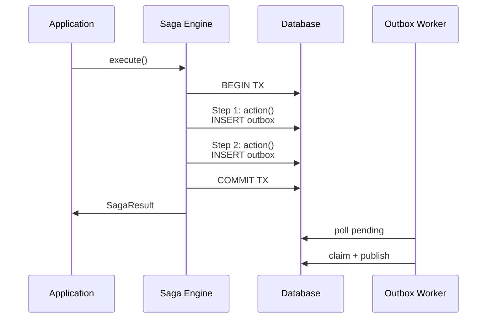
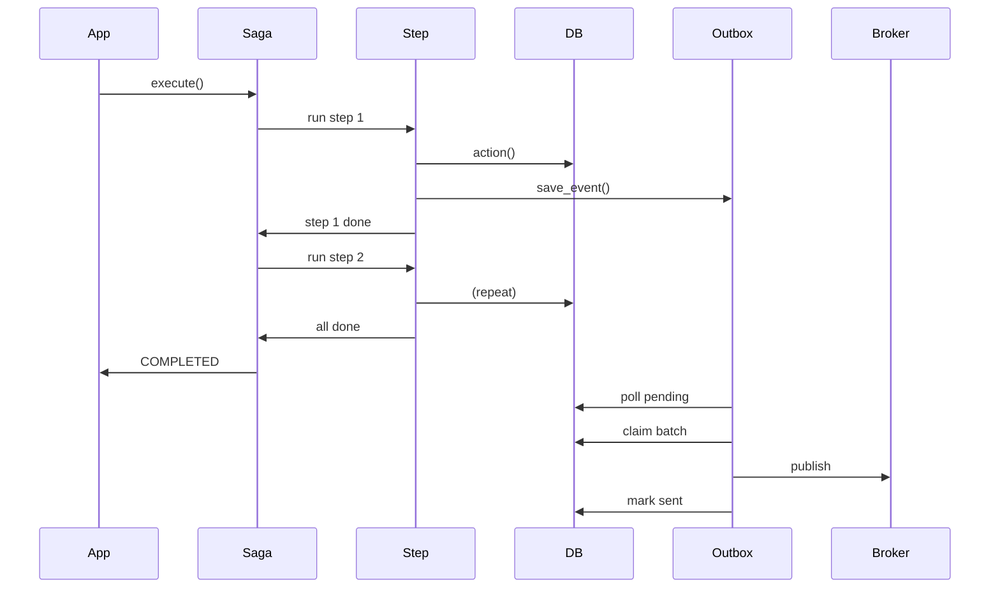
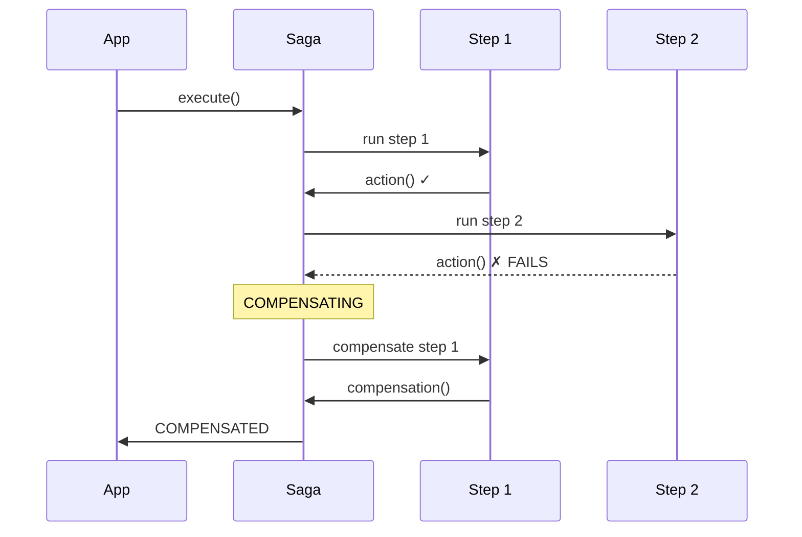
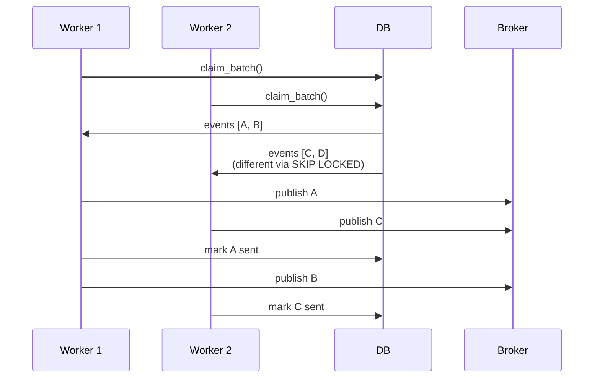
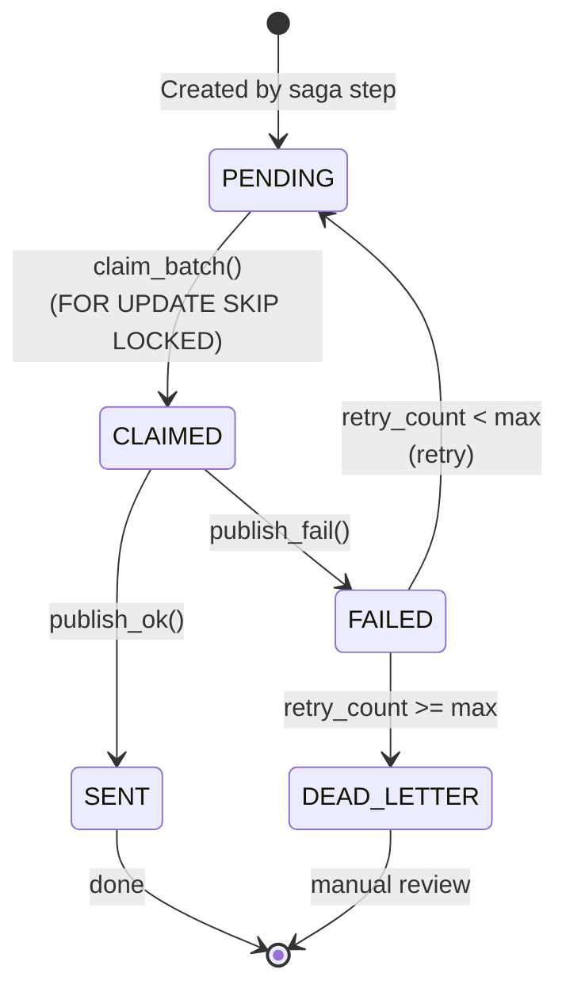
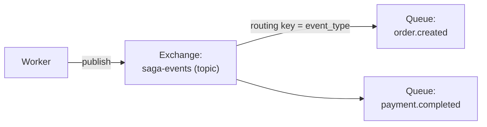
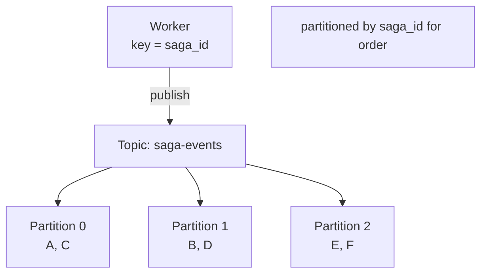
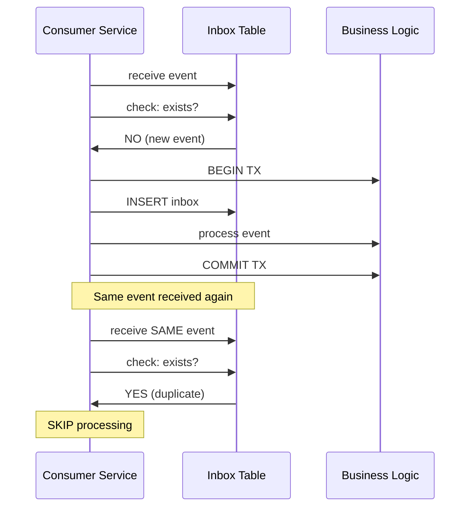

# Dataflow & Event Processing

This document describes how data flows through thesagaz system.

## Overview

---

## Use Case 1: Successful Saga Execution

---

## Use Case 2: Saga Failure with Compensation

When Step 2 fails, compensations run in reverse order.

---

## Use Case 3: Outbox Worker Processing

Multiple workers process events concurrently using `FOR UPDATE SKIP LOCKED`.

---

## Event State Machine

---

## Message Flow to Broker

### RabbitMQ

### Kafka

---

## Consumer Inbox (Idempotency)

Prevents duplicate event processing on the consumer side.

---

## Performance Characteristics

| Stage | Throughput | Latency | Bottleneck |
|-------|-----------|---------|------------|
| Event Insert (COPY) | 1,800/sec | <1ms | DB write speed |
| Event Claim | 1,500/sec | <5ms | Lock contention |
| Event Publish | 2,000/sec | <10ms | Broker ack |
| End-to-end | 1,200/sec | <50ms | Combined |

---

## Next Steps

- [Architecture Decisions](decisions.md) - Why we made these choices
- [Benchmarking Guide](../guides/benchmarking.md) - How to measure performance
