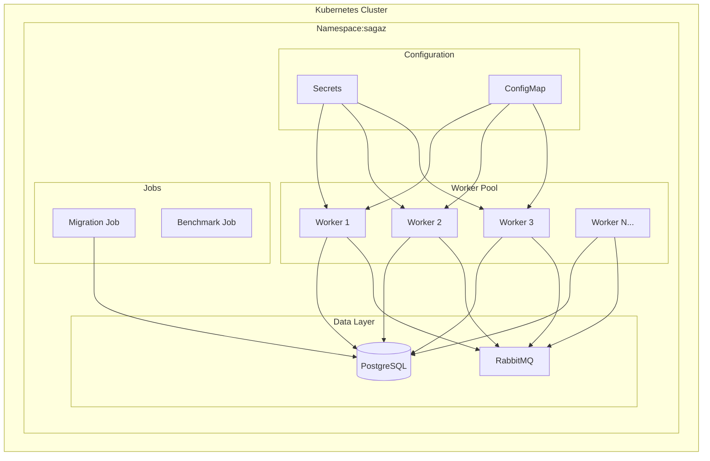
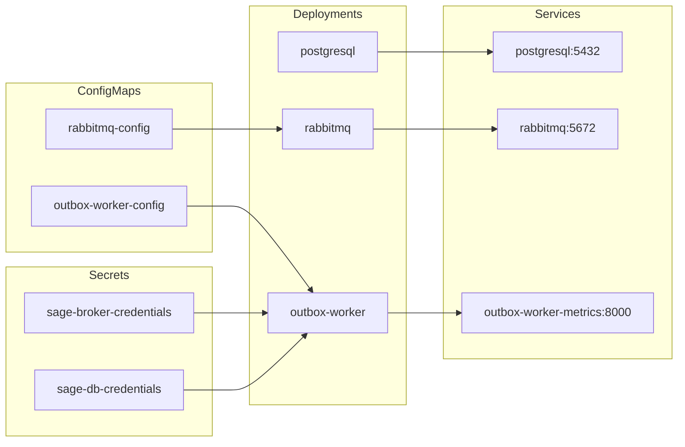
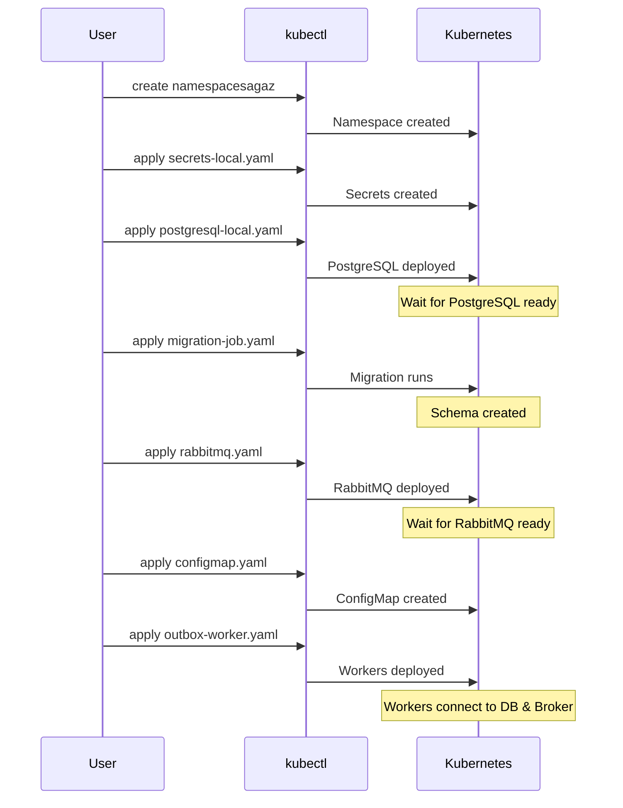
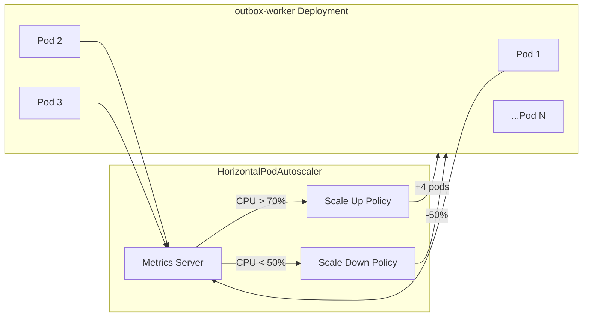
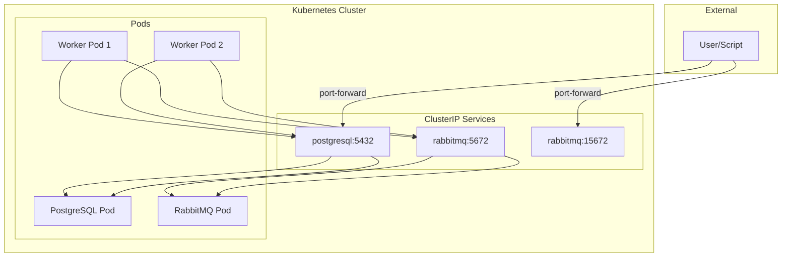

# Kubernetes Topology

Mermaid diagrams showing Kubernetes deployment architecture.

## Cluster Overview



## Resource Dependencies



## Deployment Sequence



## Worker Pod Internals

```mermaid
flowchart TB
    subgraph Pod["outbox-worker-xxx-yyy"]
        subgraph Container["worker container"]
            PROCESS[Python Process]
            
            subgraph Probes["Health Probes"]
                LIVE[Liveness: python -c import sagaz]
                READY[Readiness: python -c import sagaz]
            end
        end
        
        subgraph Volumes
            TMP[/tmp emptyDir]
        end
        
        subgraph EnvVars["Environment"]
            DB_URL[DATABASE_URL]
            WORKER_ID[WORKER_ID = pod name]
            BROKER[RABBITMQ_URL]
            CONFIG[from ConfigMap]
        end
    end
    
    EnvVars --> Container
    TMP --> Container
```

## Horizontal Pod Autoscaler



## Network Flow



## Manifest Files

| File | Resources Created |
|------|-------------------|
| `secrets-local.yaml` |sagaz-db-credentials,sagaz-broker-credentials |
| `configmap.yaml` |sagaz namespace, outbox-worker-config |
| `postgresql-local.yaml` | Deployment, Service |
| `migration-job.yaml` | Job |
| `rabbitmq.yaml` | ConfigMap, Deployment, Service |
| `outbox-worker.yaml` | Deployment, Service, ServiceAccount, PDB, HPA |
| `benchmark-job.yaml` | Job |
