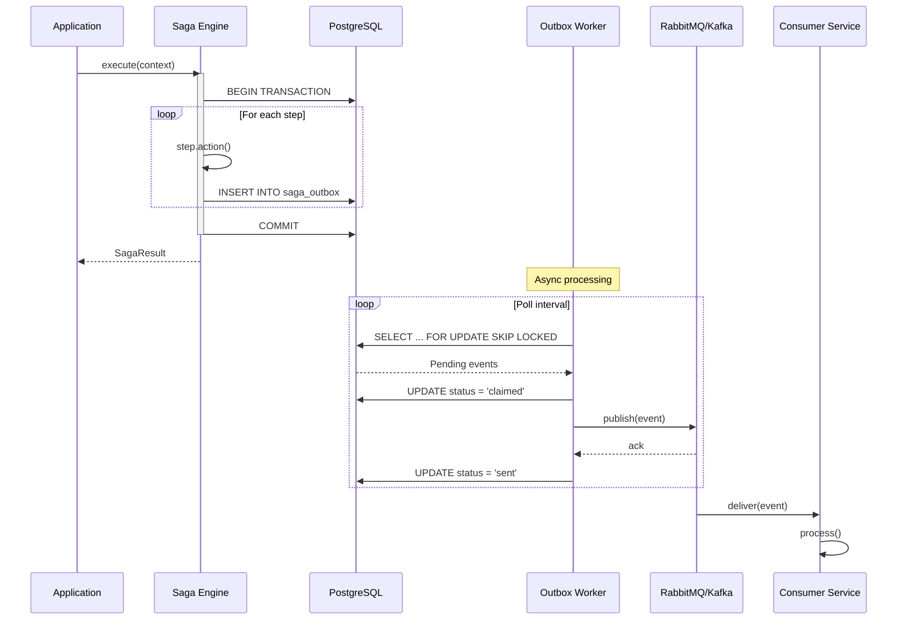
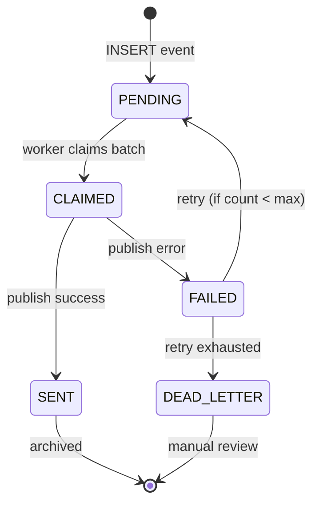
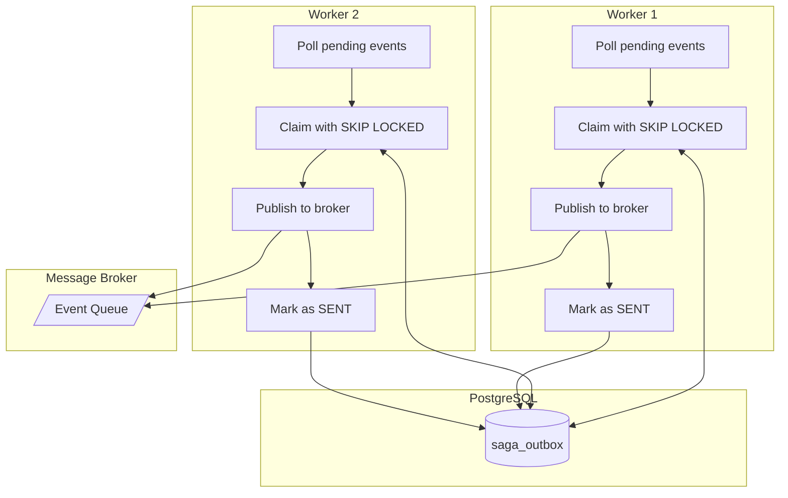
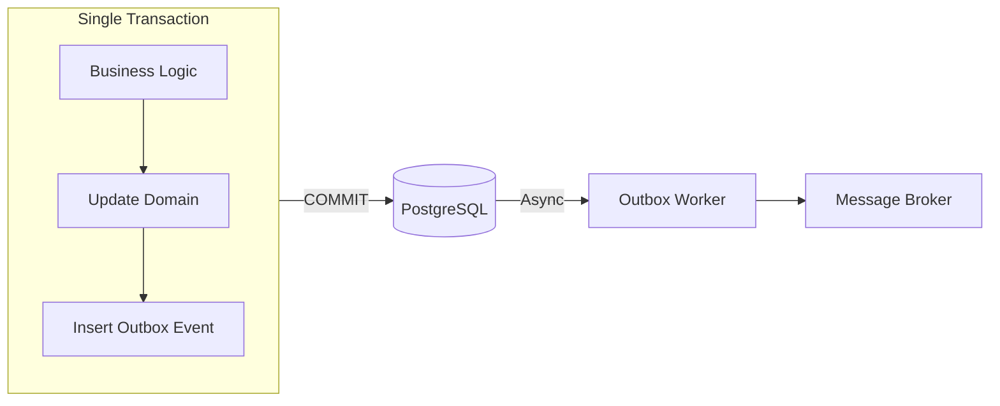
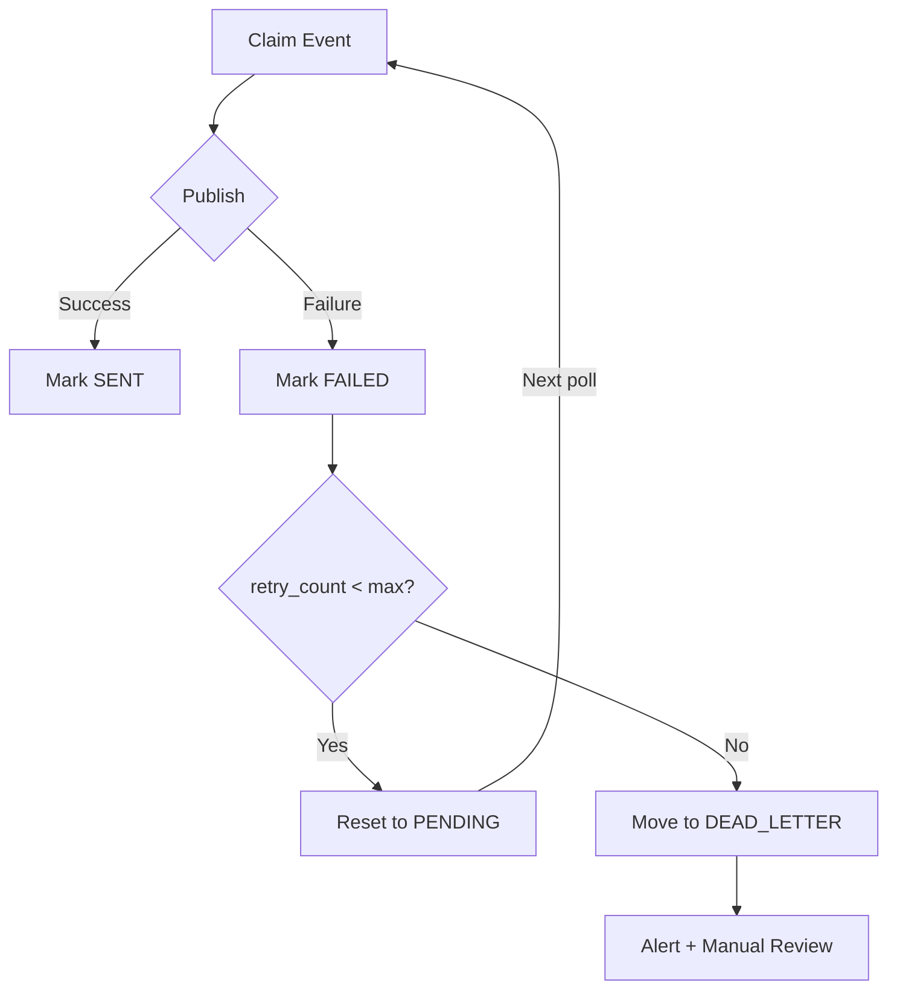
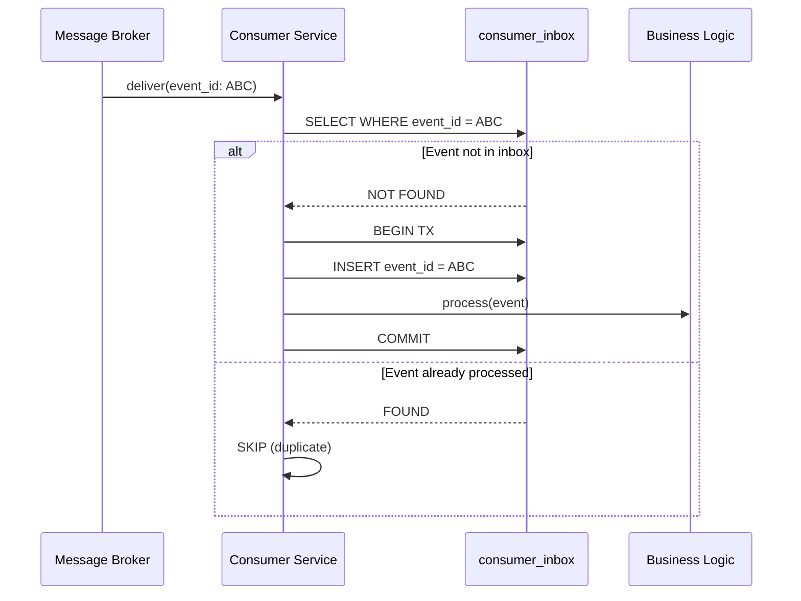

# Outbox Flow

Mermaid diagrams showing transactional outbox event flow.

## End-to-End Flow

## Event State Machine

## Worker Claim Process

## Database Transaction Boundary

## Failure & Retry Flow

## Consumer Inbox (Idempotency)

