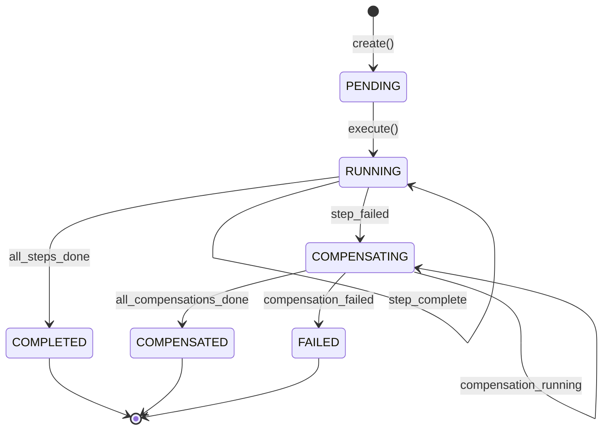
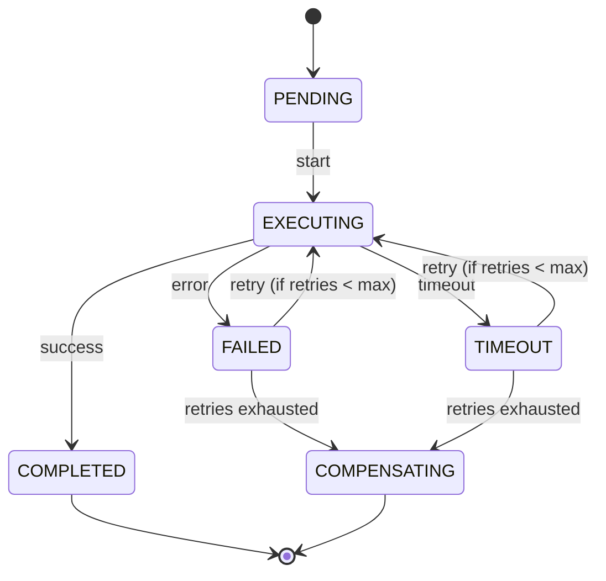
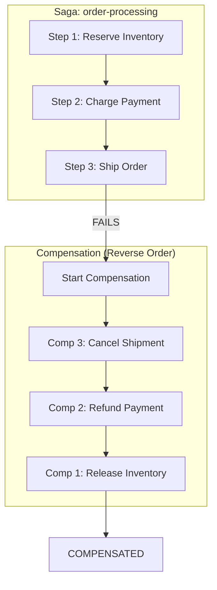
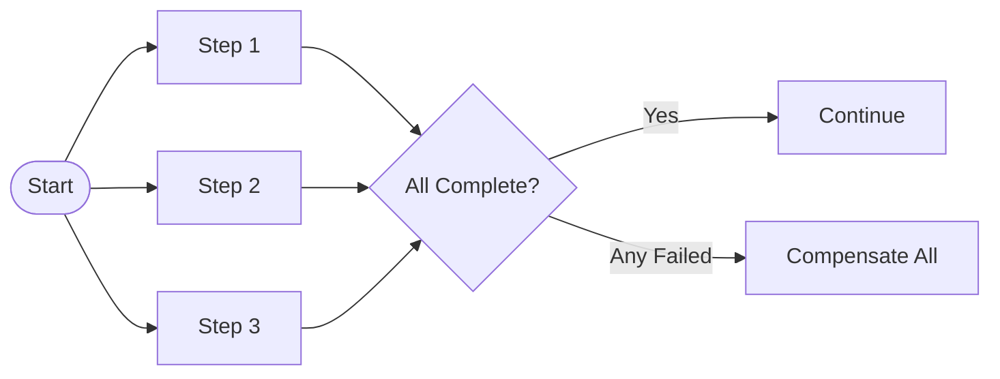

# Saga State Machine

Mermaid diagram showing saga execution states and transitions.

## Saga Execution Flow

## Step Execution States

## Compensation Flow

## Parallel Step Execution

## Status Enum Reference

| Status | Description |
|--------|-------------|
| `PENDING` | Saga created, not yet started |
| `RUNNING` | Steps are executing |
| `COMPLETED` | All steps succeeded |
| `COMPENSATING` | Failure detected, running compensations |
| `COMPENSATED` | All compensations completed |
| `FAILED` | Compensation also failed |
