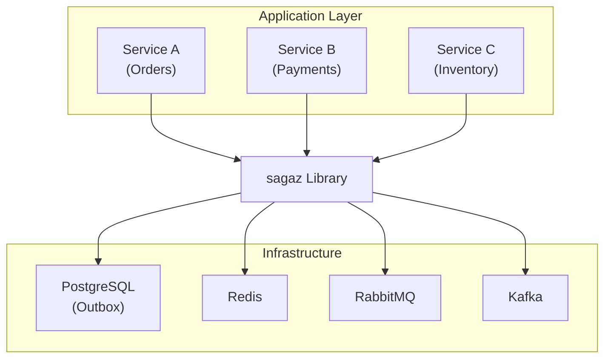
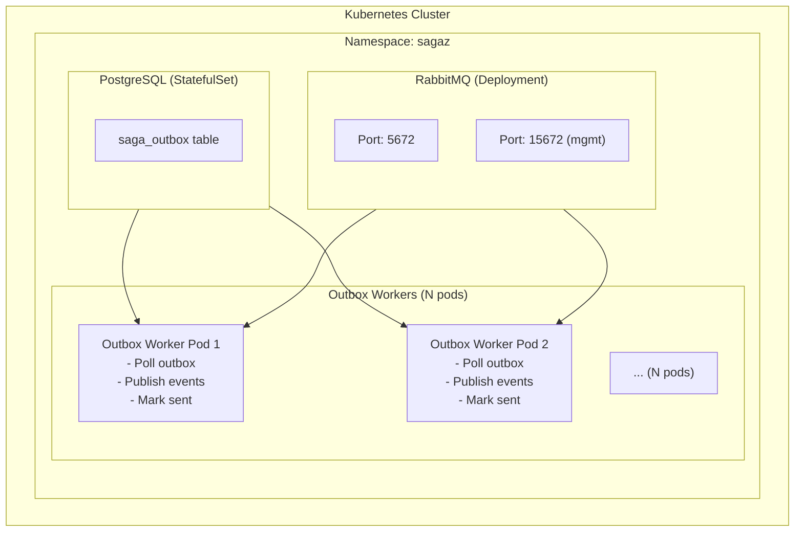
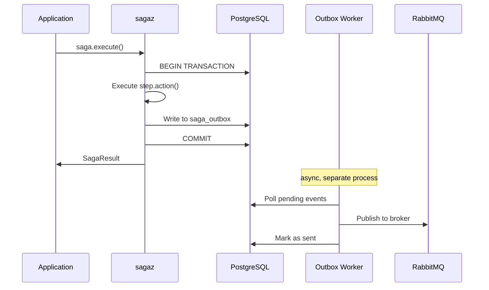
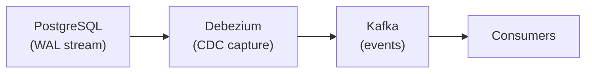

# Architecture Overview

This document describes the high-level architecture of thesagaz library.

## System Context

## Core Components

### 1. Saga Engine

The central orchestrator that manages saga execution and compensation.

| Component | Purpose | Location |
|-----------|---------|----------|
| `Saga` | Unified saga class (declarative + imperative) | `sagaz/decorators.py` |
| `SagaConfig` | Unified configuration for storage/broker/observability | `sagaz/config.py` |
| `SagaStep` | Individual step with action + compensation | `sagaz/core.py` |
| `SagaContext` | Shared state across steps | `sagaz/core.py` |
| `SagaOrchestrator` | Executes sagas with retry/timeout | `sagaz/orchestrator.py` |

> **Note:** The `Saga` class supports both declarative (decorators) and imperative (add_step) modes.
> See [ADR-015: Unified Saga API](adr/adr-015-unified-saga-api.md) for design rationale.

### 2. Outbox System

Ensures reliable event delivery through the transactional outbox pattern.

| Component | Purpose | Location |
|-----------|---------|----------|
| `OutboxStorage` | Abstract storage interface | `sagaz/outbox/storage/base.py` |
| `PostgreSQLStorage` | PostgreSQL implementation | `sagaz/outbox/storage/postgresql.py` |
| `OutboxWorker` | Background event publisher | `sagaz/outbox/worker.py` |
| `MessageBroker` | Abstract broker interface | `sagaz/outbox/brokers/base.py` |

### 3. Compensation Graph

Manages complex compensation dependencies for parallel execution.

| Component | Purpose | Location |
|-----------|---------|----------|
| `CompensationGraph` | DAG of compensation dependencies | `sagaz/compensation_graph.py` |
| `CompensationNode` | Single compensation action | `sagaz/compensation_graph.py` |

---

## Deployment Architecture

### Kubernetes Topology

### Component Interaction

---

## Design Principles

### 1. Exactly-Once Semantics

- Events stored in DB within same transaction as business data
- Worker uses `FOR UPDATE SKIP LOCKED` for safe concurrent processing
- Consumer inbox pattern prevents duplicate processing

### 2. Failure Isolation

- Each saga step is independent
- Compensation runs in reverse order on failure
- Dead-letter queue for unrecoverable events

### 3. Horizontal Scalability

- Stateless workers can scale independently
- `SKIP LOCKED` prevents worker contention
- HPA scales based on pending event count

### 4. Observability

- Prometheus metrics for monitoring
- Structured logging (JSON format)
- OpenTelemetry tracing support

---

## Future: CDC (Change Data Capture)

For high-throughput requirements (50K+ events/sec), the polling-based outbox worker can be replaced with CDC:

| Mode | Throughput | Use Case |
|------|------------|----------|
| **Polling** (current) | 1-5K/sec | Most applications |
| **CDC** (planned) | 50-100K/sec | High-throughput requirements |

See [ADR-011: CDC Support](adr-011-cdc-support.md) for full design.

---

## Next Steps

- [Component Details](components.md) - Deep dive into service artifacts
- [Dataflow](dataflow.md) - Event flow and state machines
- [Architecture Decisions](decisions.md) - Why we made these choices
- [Unified Saga API (ADR-015)](adr/adr-015-unified-saga-api.md) - Single class for declarative and imperative modes
- [Synchronous Orchestration (ADR-012)](adr/adr-012-synchronous-orchestration-model.md) - Why steps are direct calls, not messages
- [CDC Support (ADR-011)](adr/adr-011-cdc-support.md) - High-throughput upgrade path
- [Distributed Saga Support (Design)](design-distributed-saga-support.md) - Future v2.0 design for microservice sagas
- [Roadmap](../ROADMAP.md) - Planned features

