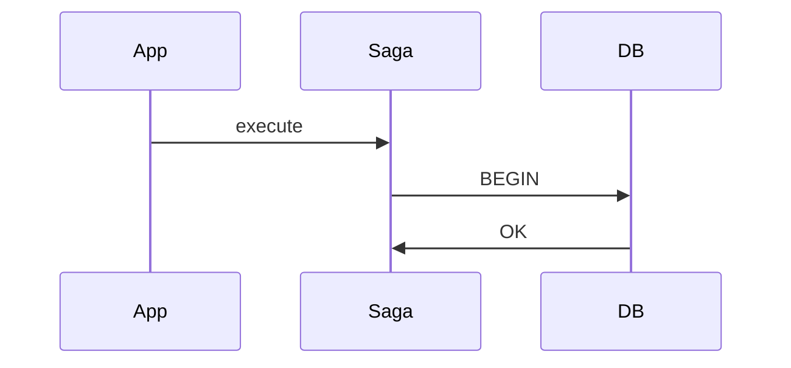
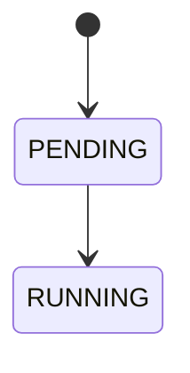

# ASCII to Mermaid Diagram Conversion Progress

## ✅ Completed Conversions

### Core Architecture Documentation

#### 1. `docs/architecture/overview.md` 
**Conversions:**
- System Context diagram → Mermaid `graph TB`
- Kubernetes Topology → Mermaid `graph TB`
- Component Interaction sequence → Mermaid `sequenceDiagram`
- CDC Flow diagram → Mermaid `graph LR`

**Impact:** High - This is a primary architecture reference document

#### 2. `docs/architecture/components.md`
**Conversions:**
- OutboxStatus state machine → Mermaid `stateDiagram-v2`

**Impact:** High - Core component state documentation

#### 3. `docs/architecture/dataflow.md`
**Conversions (8 diagrams):**
- Overview saga execution → Mermaid `sequenceDiagram`
- Use Case 1: Successful Saga → Mermaid `sequenceDiagram`
- Use Case 2: Failure with Compensation → Mermaid `sequenceDiagram`
- Use Case 3: Outbox Worker Processing → Mermaid `sequenceDiagram`
- Event State Machine → Mermaid `stateDiagram-v2`
- RabbitMQ message flow → Mermaid `graph LR`
- Kafka message flow → Mermaid `graph TB`
- Consumer Inbox flow → Mermaid `sequenceDiagram`

**Impact:** Critical - Most comprehensive dataflow documentation

### Main Documentation

#### 4. `docs/README.md`
**Conversions:**
- Saga Pattern flow → Mermaid `graph LR`
- Transactional Outbox flow → Mermaid `graph LR`

**Impact:** Critical - First document users see

### Pattern Documentation

#### 5. `docs/patterns/dead-letter-queue.md`
**Conversions:**
- DLQ Architecture → Mermaid `graph TB`

**Impact:** Medium - Pattern reference

---

## 📊 Statistics

- **Files Converted:** 5 core files
- **Diagrams Converted:** ~15 diagrams
- **Files Remaining:** 43 files with ASCII diagrams
- **Lines Reduced:** ~132 lines (more concise Mermaid syntax)

---

## 📋 Remaining Files by Priority

### High Priority (Frequently Referenced)

1. **ADR Files** (~20 files in `architecture/adr/`)
   - `adr-011-cdc-support.md` - CDC architecture diagrams
   - `adr-015-unified-saga-api.md` - API flow diagrams
   - `adr-024-saga-replay.md` - Replay flow diagrams
   - Others with architectural decision diagrams

2. **Guide Files**
   - `guides/benchmarking.md` - Performance diagrams
   - `guides/ha-postgres-quickref.md` - HA topology (27 ASCII lines)
   - `guides/kubernetes.md` - Deployment diagrams

3. **Pattern Files**
   - `patterns/consumer-inbox.md` - Inbox pattern flow
   - `patterns/multi-sink-fanout.md` - Fanout topology
   - `patterns/optimistic-sending.md` - Flow diagrams

### Medium Priority

4. **Implementation Plans** (`architecture/implementation-plans/`)
   - Various implementation architecture diagrams
   - ~10 files with technical flows

5. **Deep Dive Documents**
   - `architecture/deep-dives/compensation-graph-deep-dive.md`
   - Technical deep-dive diagrams

### Low Priority (Archive)

6. **Archive Files** (`archive/`)
   - Historical documentation
   - Lower traffic, but still referenced

---

## 🔧 Conversion Guidelines

### Common ASCII → Mermaid Patterns

#### 1. Sequence Diagrams
```
ASCII: participant ─► participant
Mermaid: sequenceDiagram
```

#### 2. State Machines
```
ASCII: [STATE] ─► [STATE]
Mermaid: stateDiagram-v2
```

#### 3. Architecture/Topology
```
ASCII: ┌──────┐ ─► ┌──────┐
Mermaid: graph TB (top-bottom) or graph LR (left-right)
```

#### 4. Component Relationships
```
ASCII: Component hierarchy with ├── └──
Keep as ASCII: These are file trees, not diagrams
```

### Mermaid Diagram Types Used

1. **`sequenceDiagram`** - For interaction flows
2. **`stateDiagram-v2`** - For state machines
3. **`graph TB/LR`** - For architecture/topology
4. **`flowchart TB/LR`** - For process flows

---

## 🚀 Next Steps

### To Continue Conversion

1. **Batch convert ADR files:**
   ```bash
   cd docs/architecture/adr
   # Convert each ADR with architectural diagrams
   ```

2. **Convert high-traffic guides:**
   ```bash
   cd docs/guides
   # Focus on ha-postgres-quickref.md (27 lines)
   # Focus on benchmarking.md (5 diagrams)
   ```

3. **Convert pattern files:**
   ```bash
   cd docs/patterns
   # consumer-inbox.md, multi-sink-fanout.md, etc.
   ```

### Automated Detection

Find remaining files:
```bash
cd docs
grep -r "^\s*[┌│└├─┐┘┤┬┴►▼▲◄]" --include="*.md" -l
```

Count diagrams per file:
```bash
for file in $(find . -name "*.md"); do 
    count=$(grep -c "^\s*[┌│└├─┐┘┤┬┴►▼▲◄]" "$file" 2>/dev/null || echo 0)
    [ "$count" -gt 0 ] && echo "$count diagrams in $file"
done | sort -rn
```

---

## 📝 Conversion Examples

### Example 1: Simple Flow

**Before (ASCII):**
```
┌────────┐     ┌────────┐     ┌────────┐
│  App   │ ──► │  Saga  │ ──► │   DB   │
└────────┘     └────────┘     └────────┘
```

**After (Mermaid):**


### Example 2: Sequence Diagram

**Before (ASCII):**
```
App         Saga         DB
 │           │           │
 │─ execute──►          │
 │           │─ BEGIN ──►
 │           │◄─ OK ────┤
```

**After (Mermaid):**


### Example 3: State Machine

**Before (ASCII):**
```
    ┌─────────┐
    │ PENDING │
    └────┬────┘
         │
    ┌────▼────┐
    │ RUNNING │
    └─────────┘
```

**After (Mermaid):**


---

## ✨ Benefits of Mermaid

1. **GitHub Native Rendering** - Renders in GitHub UI, PRs, and wiki
2. **Maintainability** - Easier to update and version control
3. **Readability** - Cleaner syntax, less visual clutter
4. **Consistency** - Standardized diagram style
5. **Tooling Support** - IDE plugins, VS Code extensions
6. **Export Options** - Can export to PNG/SVG if needed
7. **Accessibility** - Better for screen readers

---

## 🎯 Quick Reference

### Find Files Needing Conversion
```bash
cd docs && grep -r "^\s*[┌│└├─┐┘┤┬┴►▼▲◄]" --include="*.md" -l
```

### Test Mermaid Rendering
- Use [Mermaid Live Editor](https://mermaid.live/)
- Use VS Code with Mermaid preview extension
- Use GitHub's markdown preview

### Validate Changes
```bash
# Check that files were modified
git diff --stat docs/

# View specific changes
git diff docs/architecture/overview.md
```

---

## 📚 Resources

- [Mermaid Documentation](https://mermaid.js.org/)
- [Mermaid Live Editor](https://mermaid.live/)
- [GitHub Mermaid Support](https://github.blog/2022-02-14-include-diagrams-markdown-files-mermaid/)
- [Mermaid Diagram Syntax](https://mermaid.js.org/intro/)

---

**Last Updated:** 2026-01-11  
**Status:** Initial conversion of core architecture files complete  
**Next Milestone:** Convert ADR and guide files
