# Mermaid Diagram Visualization

Generate visual flowcharts of your saga structure using Mermaid.js.

## Basic Usage

```python
from sagaz import Saga, action, compensate

class OrderSaga(Saga):
    saga_name = "order"
    
    @action("reserve")
    async def reserve(self, ctx): return {}
    
    @compensate("reserve")
    async def release(self, ctx): pass
    
    @action("charge", depends_on=["reserve"])
    async def charge(self, ctx): return {}
    
    @compensate("charge")
    async def refund(self, ctx): pass
    
    @action("ship", depends_on=["charge"])
    async def ship(self, ctx): return {}
    
    @compensate("ship")
    async def cancel_ship(self, ctx): pass

saga = OrderSaga()
print(saga.to_mermaid())
```

## Output

```mermaid
flowchart TB
    START((●))
    reserve([reserve])
    charge[charge]
    ship[ship]
    SUCCESS((◎))
    ROLLED_BACK((◎))
    comp_reserve{{undo reserve}}
    comp_charge{{undo charge}}
    comp_ship{{undo ship}}
    START --> reserve
    reserve --> charge
    charge --> ship
    ship --> SUCCESS
    reserve -. fail .-> comp_reserve
    charge -. fail .-> comp_charge
    ship -. fail .-> comp_ship
    comp_ship -.-> comp_charge
    comp_charge -.-> comp_reserve
    comp_reserve -.-> ROLLED_BACK

    %% Styling
    classDef success fill:#d4edda,stroke:#28a745,color:#155724
    classDef failure fill:#f8d7da,stroke:#dc3545,color:#721c24
    classDef compensation fill:#fff3cd,stroke:#ffc107,color:#856404
    classDef startEnd fill:#333,stroke:#333,color:#fff
    class reserve,charge,ship success
    class comp_reserve,comp_charge,comp_ship compensation
    class START,SUCCESS,ROLLED_BACK startEnd

    linkStyle default stroke:#28a745
```



---

## Node Shapes

| Shape | Meaning |
|-------|---------|
| `([name])` | Root step (stadium shape) |
| `[name]` | Step with compensation (rectangle) |
| `[/name/]` | Step without compensation (parallelogram) |
| `{{undo name}}` | Compensation node (hexagon) |
| `((●))` | Initial state marker |
| `((◎))` | Final state marker |

---

## Color Styling

| Color | Meaning |
|-------|---------|
| 🟢 Green (`#d4edda`) | Success path nodes |
| 🟡 Amber (`#fff3cd`) | Compensation nodes |
| 🔴 Red (`#f8d7da`) | Failed step |
| ⬛ Black (`#333`) | State markers (START/SUCCESS/ROLLED_BACK) |
| **Bold border** | Highlighted (executed) nodes |

---

## API Reference

### `saga.to_mermaid()`

```python
def to_mermaid(
    direction: str = "TB",           # "TB", "LR", "BT", "RL"
    show_compensation: bool = True,  # Show compensation nodes
    highlight_trail: dict = None,    # Highlight execution path
    show_state_markers: bool = True, # Show ●/◎ markers
) -> str
```

### Parameters

| Parameter | Type | Default | Description |
|-----------|------|---------|-------------|
| `direction` | `str` | `"TB"` | Flow direction: TB (top-bottom), LR (left-right) |
| `show_compensation` | `bool` | `True` | Include compensation nodes and fail edges |
| `highlight_trail` | `dict` | `None` | Highlight specific execution (see below) |
| `show_state_markers` | `bool` | `True` | Include ● and ◎ state markers |

### highlight_trail Format

```python
highlight_trail = {
    "completed_steps": ["reserve", "charge"],  # Steps that succeeded
    "failed_step": "ship",                      # Step that failed (if any)
    "compensated_steps": ["charge", "reserve"]  # Steps that were compensated
}
```

---

## Fetch Trail from Storage

Instead of manually building `highlight_trail`, fetch it from storage:

```python
from sagaz.storage import PostgreSQLSagaStorage

storage = PostgreSQLSagaStorage("postgresql://localhost/sagaz")

# Generates diagram with the actual execution trail highlighted
diagram = await saga.to_mermaid_with_execution(
    saga_id="abc-123-def",
    storage=storage
)

print(diagram)
```

This will:
1. Fetch the saga state from storage
2. Extract completed_steps, failed_step, compensated_steps
3. Generate the diagram with the trail highlighted

---

## Examples

### Happy Path Only

```python
print(saga.to_mermaid(show_compensation=False))
```

### Without State Markers (Cleaner for Docs)

```python
print(saga.to_mermaid(show_state_markers=False))
```

### Left-to-Right Layout

```python
print(saga.to_mermaid(direction="LR"))
```

### Embed in Markdown

```python
print(saga.to_mermaid_markdown())
```

Output:
````markdown

````

---

## Integration

### Jupyter Notebooks

Mermaid diagrams render natively in Jupyter:

```python
from IPython.display import Markdown
display(Markdown(saga.to_mermaid_markdown()))
```

### GitHub README

GitHub renders Mermaid in markdown:

```markdown
## Saga Architecture

```mermaid
flowchart TB
    START((●))
    reserve([reserve])
    ...
```


```

### Grafana

Use the [Mermaid panel plugin](https://grafana.com/grafana/plugins/volkovlabs-mermaid-panel/) to display saga diagrams in dashboards.

---

## Tips

1. **Use `direction="LR"`** for wide sagas with many parallel branches
2. **Disable state markers** (`show_state_markers=False`) for cleaner docs
3. **Use storage integration** rather than building highlight_trail manually
4. **Render in Mermaid Live Editor** ([mermaid.live](https://mermaid.live)) to experiment
