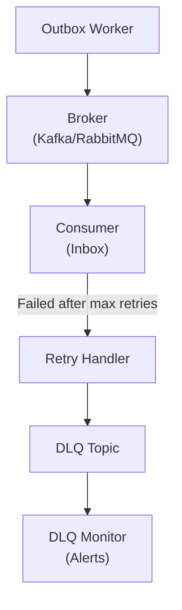

# Dead Letter Queue (DLQ) Pattern

## Overview

The Dead Letter Queue pattern handles messages that cannot be processed successfully after multiple retry attempts. Instead of losing these messages, they are moved to a separate queue for later analysis and reprocessing.

## Architecture



## Configuration

### Retry Policy

```python
from sagaz.config import SagaConfig
from sagaz.retry import RetryPolicy, ExponentialBackoff

config = SagaConfig(
    retry_policy=RetryPolicy(
        max_retries=3,
        backoff=ExponentialBackoff(
            initial_delay_ms=1000,    # 1 second
            max_delay_ms=60000,       # 1 minute max
            multiplier=2.0,           # Double each retry
            jitter=0.1,               # ±10% randomization
        ),
        retryable_exceptions=[
            "ConnectionError",
            "TimeoutError",
            "TransientDatabaseError",
        ],
        non_retryable_exceptions=[
            "ValidationError",
            "AuthenticationError",
            "BusinessRuleViolation",
        ]
    ),
    dlq=DLQConfig(
        enabled=True,
        topic_suffix="_dlq",          # saga_events_dlq
        include_stack_trace=True,
        include_original_message=True,
        alert_threshold=10,           # Alert after 10 DLQ messages/hour
    )
)
```

### Kafka DLQ Setup

```python
from sagaz.brokers.kafka import KafkaOutboxBroker

broker = KafkaOutboxBroker(
    bootstrap_servers="kafka:9092",
    topic="saga_events",
    dlq_topic="saga_events_dlq",
    consumer_group="saga-consumers",
    dlq_consumer_group="saga-dlq-processors",
)
```

### RabbitMQ DLQ Setup

```python
from sagaz.brokers.rabbitmq import RabbitMQOutboxBroker

broker = RabbitMQOutboxBroker(
    host="rabbitmq",
    exchange="saga_events",
    queue="saga_events_queue",
    dlq_exchange="saga_events_dlx",   # Dead Letter Exchange
    dlq_queue="saga_events_dlq",
    message_ttl=300000,               # 5 minutes before DLQ
)
```

## DLQ Message Format

When a message is moved to DLQ, it's wrapped with metadata:

```json
{
  "dlq_metadata": {
    "original_topic": "saga_events",
    "original_partition": 3,
    "original_offset": 12345,
    "failure_timestamp": "2024-12-27T11:45:00Z",
    "retry_count": 3,
    "last_error": {
      "type": "DatabaseConnectionError",
      "message": "Connection refused to postgres:5432",
      "stack_trace": "..."
    },
    "consumer_id": "saga-consumer-pod-abc123"
  },
  "original_message": {
    "event_type": "SAGA_STARTED",
    "saga_id": "saga-uuid-123",
    "saga_name": "OrderSaga",
    "timestamp": "2024-12-27T11:40:00Z"
  }
}
```

## Handling DLQ Messages

### Manual Review

```python
from sagaz.dlq import DLQProcessor

class DLQReviewProcessor(DLQProcessor):
    """Manual review and selective reprocessing."""
    
    async def process_dlq_message(self, message: DLQMessage):
        # Log for manual review
        logger.error(
            f"DLQ Message: {message.dlq_metadata.last_error}",
            extra={
                "saga_id": message.original_message.saga_id,
                "retry_count": message.dlq_metadata.retry_count,
            }
        )
        
        # Option 1: Fix and retry
        if self.is_fixable(message):
            fixed_message = self.fix_message(message)
            await self.republish(fixed_message)
            return DLQAction.RESOLVED
        
        # Option 2: Skip (business decision)
        if self.should_skip(message):
            return DLQAction.SKIPPED
        
        # Option 3: Keep in DLQ for later
        return DLQAction.KEEP
```

### Automatic Retry with Delay

```python
from sagaz.dlq import DelayedRetryProcessor

processor = DelayedRetryProcessor(
    delay_hours=1,           # Wait 1 hour before retry
    max_dlq_retries=2,       # Only retry DLQ messages twice
    on_final_failure=lambda msg: notify_team(msg),
)
```

## Monitoring

### Prometheus Metrics

```python
# Automatically exposed by sagaz
sagaz_dlq_messages_total{topic="saga_events_dlq", error_type="DatabaseError"}
sagaz_dlq_processing_duration_seconds{action="republish"}
sagaz_dlq_queue_depth{topic="saga_events_dlq"}
sagaz_dlq_oldest_message_age_seconds{topic="saga_events_dlq"}
```

### Grafana Dashboard

```json
{
  "title": "DLQ Monitoring",
  "panels": [
    {
      "title": "DLQ Message Rate",
      "query": "rate(sagaz_dlq_messages_total[5m])"
    },
    {
      "title": "DLQ Queue Depth",
      "query": "sagaz_dlq_queue_depth"
    },
    {
      "title": "Oldest DLQ Message Age",
      "query": "sagaz_dlq_oldest_message_age_seconds"
    },
    {
      "title": "DLQ by Error Type",
      "query": "sum by (error_type) (sagaz_dlq_messages_total)"
    }
  ]
}
```

## AlertManager Integration

See [AlertManager Rules](../monitoring/alertmanager-rules.yml) for DLQ-specific alerts.

## Best Practices

### 1. Classify Errors

```python
# Retryable (transient)
RETRYABLE = [
    "ConnectionError",
    "TimeoutError", 
    "TransientDatabaseError",
    "RateLimitExceeded",
]

# Non-retryable (permanent)
NON_RETRYABLE = [
    "ValidationError",
    "InvalidSchemaError",
    "AuthenticationError",
    "BusinessRuleViolation",
]
```

### 2. Set Appropriate Retention

```yaml
# Kafka topic config
saga_events_dlq:
  retention.ms: 604800000  # 7 days
  cleanup.policy: delete
```

### 3. Monitor DLQ Depth

- Alert when DLQ has > 0 messages
- Alert when DLQ grows faster than processing
- Alert when messages older than 24 hours exist

### 4. Implement Backpressure

```python
# Pause main queue if DLQ is too deep
if dlq_depth > 1000:
    await pause_main_consumer()
    await notify_oncall("DLQ overflow - pausing consumers")
```

### 5. Document Recovery Procedures

For each error type, document:
1. Root cause identification
2. Fix procedure
3. Replay command
4. Verification steps

## Recovery Commands

### Replay All DLQ Messages

```bash
# Using sagaz CLI
sagaz dlq replay --topic saga_events_dlq --all

# With filter
sagaz dlq replay --topic saga_events_dlq --error-type DatabaseError
```

### Purge DLQ (Caution!)

```bash
# After review, purge resolved messages
sagaz dlq purge --topic saga_events_dlq --older-than 7d --status resolved
```

### Export for Analysis

```bash
# Export to JSON for analysis
sagaz dlq export --topic saga_events_dlq --format json > dlq_messages.json
```

## Related Documentation

- [ADR-011: CDC Support](../architecture/adr/adr-011-cdc-support.md)
- [AlertManager Rules](../monitoring/alertmanager-rules.yml)
- [Outbox Pattern](outbox-pattern.md)
