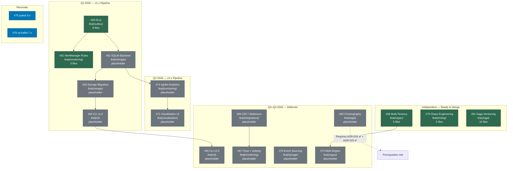

# Release DAG — Open PR Dependency Graph

> Auto-generated 2026-04-08. Covers 18 open PRs (features, placeholders, and Renovate dependency updates).

## Mermaid Diagram

## Merge Order

### Wave 1 — Independent (no blockers, implemented) → v1.2.0

| PR | Feature | ADR | Files | Copilot Reviews |
|----|---------|-----|-------|-----------------|
| **#79** | Chaos Engineering | ADR-017 | 5 | 3 actionable |
| **#81** | Saga Versioning | ADR-018 | 10 | 5 actionable |
| **#68** | Multi-Tenancy | ADR-020 | 5 | 7 actionable |

### Wave 1a — Renovate dependency updates

| PR | Feature | ADR | Files | Copilot Reviews |
|----|---------|-----|-------|-----------------|
| **#75** | pytest 9.x (renovate) | — | 1 | — |
| **#76** | cp-kafka 7.x (renovate) | — | 1 | — |

### Wave 2 — DLQ + AlertManager → v1.3.0

| PR | Feature | Depends On | Files |
|----|---------|------------|-------|
| **#60** | Dead Letter Queue | main | 8 |
| **#61** | AlertManager Rules | #60 | 3 |

### Wave 3 — Storage + Analytics → v1.4.0

| PR | Feature | Depends On | Files |
|----|---------|------------|-------|
| **#62** | SQLite Backend | #60 | placeholder |
| **#63** | Storage Migration | #62 | placeholder |
| **#74** | sqldim Analytics | #62 | placeholder |

### Wave 4 — CLI + Visualization → v1.5.0

| PR | Feature | Depends On | Files |
|----|---------|------------|-------|
| **#64** | CLI v1.0 | #63 | placeholder |
| **#71** | Visualization UI | #74 | placeholder |

### Wave 5 — Q3/Q4 Deferred → v2.0.0+

| PR | Feature | ADR | Target |
|----|---------|-----|--------|
| **#65** | CLI v2.0 | — | v2.0.0 |
| **#66** | CDC / Debezium | ADR-011 | v2.0.0 |
| **#67** | Fluss + Iceberg | ADR-013 | v2.1.0 |
| **#69** | Choreography | ADR-029 | v2.2.0 |
| **#70** | Event Sourcing | ADR-033 | v2.3.0 |
| **#72** | Multi-Region | ADR-034 | v2.4.0 |

## Release Roadmap

> Current release: **v1.1.2**

All Wave 1 PRs add new modules without modifying existing APIs.
Wave 5 targets the v2.x line because choreography and event sourcing
will require core `Saga` interface changes (breaking).

| Release | Type | PRs | Rationale |
|---------|------|-----|-----------|
| **v1.2.0** | MINOR | #68, #79, #81, #75, #76 | 3 new feature modules (additive), 2 dep bumps |
| **v1.3.0** | MINOR | #60, #61 | DLQ + AlertManager (new outbox/monitoring APIs) |
| **v1.4.0** | MINOR | #62, #63, #74 | SQLite backend, migration layer, analytics |
| **v1.5.0** | MINOR | #64, #71 | CLI v1 + visualization dashboard |
| **v2.0.0** | MAJOR | #65, #66, #67, #69, #70, #72 | Choreography + event sourcing change core APIs |

### Why v1.2.0 instead of v2.0.0 for saga versioning?

ADR-018 originally targeted v2.0.0, but the implementation (#81) is
purely additive: it introduces `sagaz.versioning` without modifying any
existing public API. Per semver, a MINOR bump is correct. The v2.0.0
milestone is reserved for Wave 5 features that *do* alter the core
`Saga` interface (choreography mode, event sourcing strategy).

## Legend

- **implemented** (green): PR has real code changes, tests, and is review-ready
- **placeholder** (grey): PR exists with skeleton commit only — implementation pending
- **renovate** (blue): Automated dependency updates
