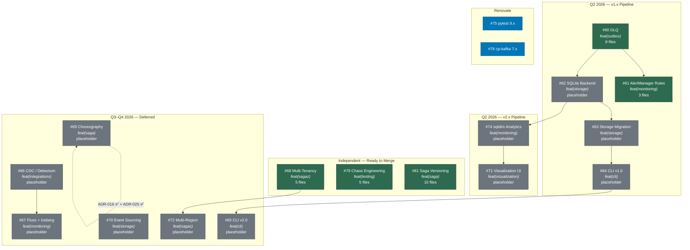

# Release DAG — Open PR Dependency Graph

> Auto-generated 2026-04-08. Represents the merge ordering for all open PRs.

## Mermaid Diagram

## Merge Order

### Wave 1 — Independent (no blockers, implemented)

| PR | Feature | ADR | Files | Copilot Reviews |
|----|---------|-----|-------|-----------------|
| **#79** | Chaos Engineering | ADR-017 | 5 | 3 actionable |
| **#81** | Saga Versioning | ADR-018 | 10 | 5 actionable |
| **#68** | Multi-Tenancy | ADR-020 | 5 | 7 actionable |

### Wave 1a — Renovate dependency updates

| PR | Feature | ADR | Files | Copilot Reviews |
|----|---------|-----|-------|-----------------|
| **#75** | pytest 9.x (renovate) | — | 1 | — |
| **#76** | cp-kafka 7.x (renovate) | — | 1 | — |

### Wave 2 — DLQ + AlertManager (v1.1.0)

| PR | Feature | Depends On | Files |
|----|---------|------------|-------|
| **#60** | Dead Letter Queue | main | 8 |
| **#61** | AlertManager Rules | #60 | 3 |

### Wave 3 — Storage + Analytics (v1.3.1 / v2.2.0-beta)

| PR | Feature | Depends On | Files |
|----|---------|------------|-------|
| **#62** | SQLite Backend | #60 | placeholder |
| **#63** | Storage Migration | #62 | placeholder |
| **#74** | sqldim Analytics | #62 | placeholder |

### Wave 4 — CLI + Visualization (v1.5.0 / v2.2.0-beta)

| PR | Feature | Depends On | Files |
|----|---------|------------|-------|
| **#64** | CLI v1.0 | #63 | placeholder |
| **#71** | Visualization UI | #74 | placeholder |

### Wave 5 — Q3/Q4 Deferred

| PR | Feature | ADR | Target |
|----|---------|-----|--------|
| **#65** | CLI v2.0 | — | v2.0.0 (Q3) |
| **#66** | CDC / Debezium | ADR-011 | v2.0.0 (Q3) |
| **#67** | Fluss + Iceberg | ADR-013 | v2.1.0 (Q3) |
| **#69** | Choreography | ADR-029 | v2.2.0 (Q3) |
| **#70** | Event Sourcing | ADR-033 | v2.3.0 (Q4) |
| **#72** | Multi-Region | ADR-034 | v2.4.0 (Q4) |

## Legend

- **implemented** (green): PR has real code changes, tests, and is review-ready
- **placeholder** (grey): PR exists with skeleton commit only — implementation pending
- **renovate** (blue): Automated dependency updates
